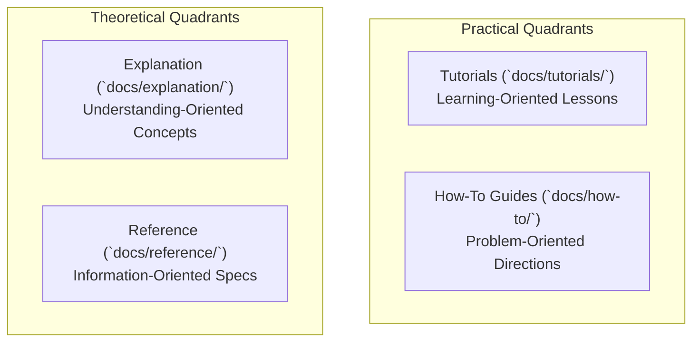

# 📚 CMSForNerd2 Documentation System

Welcome to the **CMSForNerd2** documentation system. This repository utilizes the **Diátaxis Framework**, a systematic approach to technical documentation design.

---

## 🏛️ What is the Diátaxis Framework?

The Diátaxis Framework organizes documentation into four distinct quadrants, each serving a unique user need and operational context:

#### 1. ASCII Tree Diagram

```
                  PRACTICAL
                     ▲
                     │
     TUTORIALS       │      HOW-TO GUIDES
  (Learning-oriented)│   (Problem-oriented)
                     │
◀────────────────────┼────────────────────▶
                     │
    EXPLANATION      │      REFERENCE
  (Understanding-    │   (Information-
     oriented)       │      oriented)
                     │
                     ▼
                THEORETICAL
```

#### 2. Standalone Dark Slate Raw SVG Vector Graphic (`.svg`)

```xml
<svg xmlns="http://www.w3.org/2000/svg" viewBox="0 0 800 360" width="100%" height="100%">
  <rect width="100%" height="100%" fill="#0F172A" rx="12"/>

  <text x="400" y="35" text-anchor="middle" fill="#60A5FA" font-family="-apple-system, sans-serif" font-size="16" font-weight="bold" letter-spacing="1">THE DIÁTAXIS DOCUMENTATION QUADRANT ARCHITECTURE</text>

  <!-- Quadrant 1: Tutorials -->
  <rect x="50" y="60" width="330" height="125" rx="10" fill="#1E293B" stroke="#38BDF8" stroke-width="1.5"/>
  <rect x="50" y="60" width="330" height="24" rx="10" fill="#0284C7"/>
  <text x="215" y="77" text-anchor="middle" fill="#FFFFFF" font-family="-apple-system, sans-serif" font-size="11" font-weight="bold">TUTORIALS (Learning-Oriented)</text>
  <text x="215" y="105" text-anchor="middle" fill="#F8FAFC" font-family="-apple-system, sans-serif" font-size="12" font-weight="bold">docs/tutorials/</text>
  <text x="215" y="130" text-anchor="middle" fill="#E2E8F0" font-family="-apple-system, sans-serif" font-size="11">• Guided lessons for newcomers</text>
  <text x="215" y="150" text-anchor="middle" fill="#94A3B8" font-family="Consolas, monospace" font-size="10">Focus: Practical Learning Success</text>

  <!-- Quadrant 2: How-To Guides -->
  <rect x="420" y="60" width="330" height="125" rx="10" fill="#1E293B" stroke="#4ADE80" stroke-width="1.5"/>
  <rect x="420" y="60" width="330" height="24" rx="10" fill="#15803D"/>
  <text x="585" y="77" text-anchor="middle" fill="#FFFFFF" font-family="-apple-system, sans-serif" font-size="11" font-weight="bold">HOW-TO GUIDES (Problem-Oriented)</text>
  <text x="585" y="105" text-anchor="middle" fill="#F8FAFC" font-family="-apple-system, sans-serif" font-size="12" font-weight="bold">docs/how-to/</text>
  <text x="585" y="130" text-anchor="middle" fill="#E2E8F0" font-family="-apple-system, sans-serif" font-size="11">• Step-by-step directions for real tasks</text>
  <text x="585" y="150" text-anchor="middle" fill="#94A3B8" font-family="Consolas, monospace" font-size="10">Focus: Task Completion</text>

  <!-- Quadrant 3: Explanation -->
  <rect x="50" y="205" width="330" height="125" rx="10" fill="#1E293B" stroke="#C084FC" stroke-width="1.5"/>
  <rect x="50" y="205" width="330" height="24" rx="10" fill="#6B21A8"/>
  <text x="215" y="222" text-anchor="middle" fill="#FFFFFF" font-family="-apple-system, sans-serif" font-size="11" font-weight="bold">EXPLANATION (Understanding-Oriented)</text>
  <text x="215" y="250" text-anchor="middle" fill="#F8FAFC" font-family="-apple-system, sans-serif" font-size="12" font-weight="bold">docs/explanation/</text>
  <text x="215" y="275" text-anchor="middle" fill="#E2E8F0" font-family="-apple-system, sans-serif" font-size="11">• Architectural concepts &amp; rationale</text>
  <text x="215" y="295" text-anchor="middle" fill="#94A3B8" font-family="Consolas, monospace" font-size="10">Focus: System Comprehension</text>

  <!-- Quadrant 4: Reference -->
  <rect x="420" y="205" width="330" height="125" rx="10" fill="#1E293B" stroke="#FBBF24" stroke-width="1.5"/>
  <rect x="420" y="205" width="330" height="24" rx="10" fill="#B45309"/>
  <text x="585" y="222" text-anchor="middle" fill="#FFFFFF" font-family="-apple-system, sans-serif" font-size="11" font-weight="bold">REFERENCE (Information-Oriented)</text>
  <text x="585" y="250" text-anchor="middle" fill="#F8FAFC" font-family="-apple-system, sans-serif" font-size="12" font-weight="bold">docs/reference/</text>
  <text x="585" y="275" text-anchor="middle" fill="#E2E8F0" font-family="-apple-system, sans-serif" font-size="11">• CLI specifications, APIs, &amp; schemas</text>
  <text x="585" y="295" text-anchor="middle" fill="#94A3B8" font-family="Consolas, monospace" font-size="10">Focus: Precise Technical Lookup</text>
</svg>
```

#### 3. Git-Native Mermaid Diagram (`.mmd`)



#### 4. Summary Interface & Routing Table

| Quadrant | Directory Path | User Goal | Focus Area | Example Asset |
| :--- | :--- | :--- | :--- | :--- |
| **Tutorials** | `docs/tutorials/` | Learning the system | Immediate onboarding success | `docs/tutorials/local-development.md` |
| **How-To Guides** | `docs/how-to/` | Solving a task | Task completion & problem solving | `docs/how-to/okf-refactoring.md` |
| **Explanation** | `docs/explanation/` | Understanding architecture | Concepts & design rationale | `docs/explanation/modernisation-philosophy.md` |
| **Reference** | `docs/reference/` | Technical lookup | Precise specifications & APIs | `docs/reference/deploy-static.md` |

---

## 🧭 Navigational Index

To explore our documentation system, navigate using the following curated pathways:

* **Learning Pathways (Tutorials)**
  * [Local Development Quickstart](tutorials/local-development.md) — Learn how to set up, build, and run the CMSForNerd2 workspace locally.
  * [Static Site Deployment](tutorials/static-site-deployment.md) — Step-by-step lesson to deploy the CMS statically onto cloud hosting.
* **Practical Workflows (How-To Guides)**
  * [OKF Frontmatter Refactoring](how-to/okf-refactoring.md) — How to automatically validate and repair Markdown metadata.
  * [Sitemap Verification](how-to/sitemap-verification.md) — How to verify that generated sitemap links match built static files.
  * [Ansible Static Security Hardening](how-to/ansible-deployment.md) — How to configure and deploy a production static site with dual-pathway branching.
* **Technical Specifications (Reference)**
  * [`refactor-okf.cjs` API](reference/refactor-okf.md) — Reference specifications for the YAML validation crawler.
  * [`verify-sitemaps.js` API](reference/verify-sitemaps.md) — Reference specifications for the sitemap testing engine.
  * [`deploy-static.sh` Orchestrator](reference/deploy-static.md) — Specifications for the dual-pathway bash deployment orchestrator.
  * [`llms_txt2ctx.py` CLI](reference/llms-txt2ctx.md) — Parser interface specifications for generating XML contexts.
* **Conceptual Depth (Explanation)**
  * [Legacy PHP to SSG Modernisation](explanation/modernisation-philosophy.md) — Why we migrated from PHP to Astro.
  * [Spatial Memory & Dual Pathways](explanation/spatial-memory-and-sandbox.md) — Explaining sandbox boundaries and Google Jules compatibility.

---
*Deep State of Mind (DSOM) For My AI Protocol | Harisfazillah Jamel (LinuxMalaysia) | 2026-09-08*
*Standard: UK English | DBP-standard Bahasa Melayu Malaysia (Piawai) | GNU General Public License v3.0*
