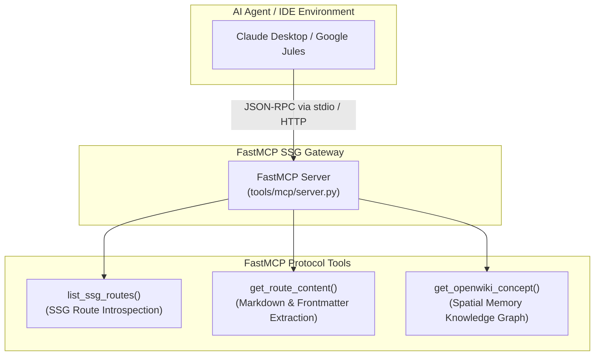
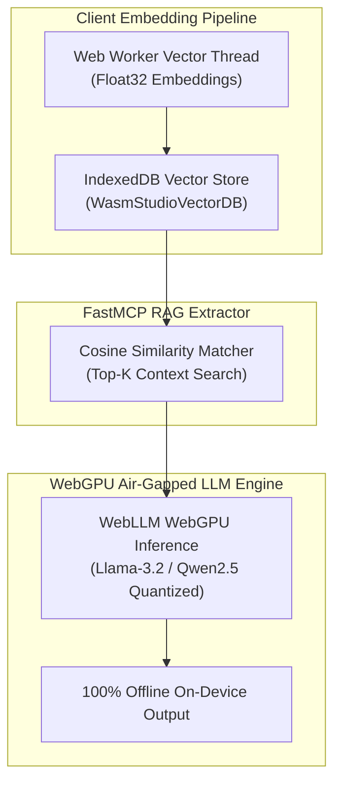

# FastMCP Protocol & WebAssembly (Wasm) Architecture

This document provides a conceptual explanation of the **FastMCP Model Context Protocol** server integration and the **WebAssembly (Wasm)** client-side architecture in CMSForNerd2.

---

## 1. FastMCP SSG Route Exposure for AI Agents

Modern AI agents (e.g. Claude Desktop, Cursor, Google Jules) require fast, deterministic introspection of web platform assets without scanning unindexed file trees or relying on brittle web scrapers.

### Architecture Overview

#### 1. ASCII Tree Diagram

```
                             ┌───────────────────────┐
                             │  AI Agent / Client    │
                             │ (Claude / Jules/ IDE) │
                             └───────────┬───────────┘
                                         │
                            JSON-RPC (stdio / HTTP)
                                         │
                                         ▼
                             ┌───────────────────────┐
                             │ FastMCP SSG Gateway   │
                             │ (tools/mcp/server.py) │
                             └───────────┬───────────┘
                                         │
                ┌────────────────────────┼────────────────────────┐
                ▼                        ▼                        ▼
     ┌─────────────────────┐  ┌─────────────────────┐  ┌─────────────────────┐
     │  list_ssg_routes()  │  │ get_route_content() │  │ get_openwiki_...()  │
     │  Exposes SSG routes │  │ Body & Frontmatter  │  │ Spatial Memory RAG  │
     └─────────────────────┘  └─────────────────────┘  └─────────────────────┘
```

#### 2. Standalone Dark Slate Raw SVG Vector Graphic (`.svg`)

```xml
<svg xmlns="http://www.w3.org/2000/svg" viewBox="0 0 800 380" width="100%" height="100%">
  <defs>
    <marker id="arrow" viewBox="0 0 10 10" refX="6" refY="5" markerWidth="6" markerHeight="6" orient="auto-start-reverse">
      <path d="M 0 0 L 10 5 L 0 10 z" fill="#94A3B8"/>
    </marker>
  </defs>

  <rect width="100%" height="100%" fill="#0F172A" rx="12"/>

  <text x="400" y="35" text-anchor="middle" fill="#60A5FA" font-family="-apple-system, sans-serif" font-size="16" font-weight="bold" letter-spacing="1">FASTMCP SSG ROUTE EXPOSURE ARCHITECTURE</text>

  <!-- Client Node -->
  <rect x="250" y="60" width="300" height="60" rx="10" fill="#1E293B" stroke="#38BDF8" stroke-width="2"/>
  <rect x="250" y="60" width="300" height="24" rx="10" fill="#0284C7"/>
  <text x="400" y="77" text-anchor="middle" fill="#FFFFFF" font-family="-apple-system, sans-serif" font-size="12" font-weight="bold">AI AGENT / IDE CLIENT</text>
  <text x="400" y="102" text-anchor="middle" fill="#F8FAFC" font-family="Consolas, monospace" font-size="11">Claude Desktop / Cursor / Google Jules</text>

  <!-- Connector -->
  <path d="M 400 120 L 400 170" stroke="#94A3B8" stroke-width="2" marker-end="url(#arrow)"/>
  <rect x="330" y="135" width="140" height="20" rx="10" fill="#334155"/>
  <text x="400" y="149" text-anchor="middle" fill="#E2E8F0" font-family="Consolas, monospace" font-size="10">JSON-RPC / stdio</text>

  <!-- FastMCP Server Gateway -->
  <rect x="250" y="170" width="300" height="60" rx="10" fill="#1E293B" stroke="#4ADE80" stroke-width="2"/>
  <rect x="250" y="170" width="300" height="24" rx="10" fill="#15803D"/>
  <text x="400" y="187" text-anchor="middle" fill="#FFFFFF" font-family="-apple-system, sans-serif" font-size="12" font-weight="bold">FASTMCP GATEWAY SERVER</text>
  <text x="400" y="212" text-anchor="middle" fill="#F8FAFC" font-family="Consolas, monospace" font-size="11">tools/mcp/server.py</text>

  <!-- Branch Connectors -->
  <path d="M 300 230 L 150 280" stroke="#94A3B8" stroke-width="2" marker-end="url(#arrow)"/>
  <path d="M 400 230 L 400 280" stroke="#94A3B8" stroke-width="2" marker-end="url(#arrow)"/>
  <path d="M 500 230 L 650 280" stroke="#94A3B8" stroke-width="2" marker-end="url(#arrow)"/>

  <!-- Endpoint Cards -->
  <rect x="30" y="280" width="220" height="70" rx="8" fill="#1E293B" stroke="#334155" stroke-width="1.5"/>
  <text x="140" y="300" text-anchor="middle" fill="#38BDF8" font-family="Consolas, monospace" font-size="11" font-weight="bold">list_ssg_routes()</text>
  <text x="140" y="325" text-anchor="middle" fill="#E2E8F0" font-family="-apple-system, sans-serif" font-size="10">SSG Route Introspection</text>

  <rect x="290" y="280" width="220" height="70" rx="8" fill="#1E293B" stroke="#334155" stroke-width="1.5"/>
  <text x="400" y="300" text-anchor="middle" fill="#4ADE80" font-family="Consolas, monospace" font-size="11" font-weight="bold">get_route_content()</text>
  <text x="400" y="325" text-anchor="middle" fill="#E2E8F0" font-family="-apple-system, sans-serif" font-size="10">Frontmatter &amp; Body Extraction</text>

  <rect x="550" y="280" width="220" height="70" rx="8" fill="#1E293B" stroke="#334155" stroke-width="1.5"/>
  <text x="660" y="300" text-anchor="middle" fill="#C084FC" font-family="Consolas, monospace" font-size="11" font-weight="bold">get_openwiki_concept()</text>
  <text x="660" y="325" text-anchor="middle" fill="#E2E8F0" font-family="-apple-system, sans-serif" font-size="10">Spatial Memory Graph RAG</text>
</svg>
```

#### 3. Git-Native Mermaid Diagram (`.mmd`)



#### 4. Summary Interface & Routing Table

| Source Component | Target Component | Ingress / Protocol | Trust Zone / Security Boundary | Operational Significance / Flow Description |
| :--- | :--- | :--- | :--- | :--- |
| AI Agent Client | FastMCP Gateway | `stdio` / JSON-RPC | Local Workspace Process | Initiates tool requests to query static site routes and spatial memory concept graphs. |
| FastMCP Gateway | SSG Content Store | Direct File I/O | Repository Workspace (`src/content/pages/`) | Extracts raw Markdown body, frontmatter metadata, and sitemap routes for AI model ingestion. |

---

### Key Capabilities

1. **Deterministic Route Mapping**: Exposes every Astro SSG route directly as structured JSON objects (`list_ssg_routes()`), eliminating link-crawling overhead.
2. **On-Demand Content Retrieval**: Delivers clean frontmatter and Markdown body text (`get_route_content()`) for instant context ingestion.
3. **Spatial Memory Introspection**: Integrates with Deep State of Mind (DSOM) knowledge base (`get_openwiki_concept()`) to share active spatial memory directly with AI subagents.

---

## 2. WebAssembly (Wasm) Client-Side Search Engine (Pagefind)

Search engines traditionally require dedicated backend servers (e.g., Elasticsearch, Solr, Meilisearch) or heavy serverless endpoints. CMSForNerd2 eliminates backend runtime overhead by adopting **Pagefind**, a static search engine compiled to **WebAssembly (Wasm)**.

### How Pagefind Wasm Works

- **Build-Time Compilation**: During `npm run build`, `pagefind --site dist` parses compiled HTML output in `dist/` and compiles static Wasm index files (`dist/pagefind/wasm.en.pagefind`).
- **Zero Server Overhead**: At runtime, browser JS loads the Pagefind Wasm engine (`pagefind-ui.js`), which queries the binary Wasm index locally.
- **Micro-Bundle Bandwidth**: Index files are chunked into tiny Wasm segments, ensuring users download only byte ranges necessary for their search query.

---

## 3. WebAssembly (Wasm) Client Cryptographic & Document Processing

To align with modern Zero-Trust static security standards, CMSForNerd2 includes client-side WebAssembly tools for cryptographic hashing and OKF v0.2 document parsing.

### Cryptographic Whitelisting
- **Browser-Native Execution**: Hashing functions execute using WebAssembly/WebCrypto APIs inside local browser memory.
- **CSP Integrity Verification**: Generates Base64 SHA-256 digests (`'sha256-...'`) for inline script whitelisting in Nginx Content Security Policy headers.

### OKF v0.2 Schema Processing
- Parses Open Knowledge Format frontmatter schemas, verifying trust and freshness pillars (`status`, `stale_after`, `sources`, `generated`).
- Guarantees complete user privacy: documents are analyzed entirely client-side with zero external data transmission.

---

## 4. WebLLM + WebGPU On-Device Air-Gapped RAG Generation

To enable 100% offline, air-gapped intelligence inside static sites, CMSForNerd2 pairs Web Worker Float32 vector embeddings and IndexedDB persistence with local in-browser LLMs (WebLLM running quantized Llama/Qwen models over WebGPU).

#### 1. ASCII Tree Diagram

```
 ┌──────────────────────┐     ┌──────────────────────┐     ┌──────────────────────┐
 │  Web Worker Vector   │ ──▶ │ IndexedDB Vector     │ ──▶ │  FastMCP RAG Context │
 │  Embedding Thread    │     │ Store (WasmStudio)   │     │  Search Extractor    │
 └──────────────────────┘     └──────────────────────┘     └──────────┬───────────┘
                                                                      │
                                                                      ▼
 ┌────────────────────────────────────────────────────────────────────────────────┐
 │ WebLLM WebGPU On-Device LLM Generator (Llama-3.2-1B / Qwen2.5 Quantized Model) │
 └────────────────────────────────────────────────────────────────────────────────┘
```

#### 2. Standalone Dark Slate Raw SVG Vector Graphic (`.svg`)

```xml
<svg xmlns="http://www.w3.org/2000/svg" viewBox="0 0 800 340" width="100%" height="100%">
  <defs>
    <marker id="arrow" viewBox="0 0 10 10" refX="6" refY="5" markerWidth="6" markerHeight="6" orient="auto-start-reverse">
      <path d="M 0 0 L 10 5 L 0 10 z" fill="#94A3B8"/>
    </marker>
  </defs>

  <rect width="100%" height="100%" fill="#0F172A" rx="12"/>

  <text x="400" y="35" text-anchor="middle" fill="#C084FC" font-family="-apple-system, sans-serif" font-size="16" font-weight="bold" letter-spacing="1">WEBLLM WEBGPU ON-DEVICE AIR-GAPPED RAG ARCHITECTURE</text>

  <!-- Stage 1 -->
  <rect x="30" y="70" width="220" height="90" rx="10" fill="#1E293B" stroke="#38BDF8" stroke-width="1.5"/>
  <rect x="30" y="70" width="220" height="24" rx="10" fill="#0284C7"/>
  <text x="140" y="87" text-anchor="middle" fill="#FFFFFF" font-family="-apple-system, sans-serif" font-size="11" font-weight="bold">WEB WORKER VECTOR THREAD</text>
  <text x="140" y="115" text-anchor="middle" fill="#F8FAFC" font-family="-apple-system, sans-serif" font-size="11">Float32 Embedding Pipeline</text>
  <text x="140" y="135" text-anchor="middle" fill="#94A3B8" font-family="Consolas, monospace" font-size="10">Non-blocking Blob Worker</text>

  <path d="M 250 115 L 290 115" stroke="#94A3B8" stroke-width="2" marker-end="url(#arrow)"/>

  <!-- Stage 2 -->
  <rect x="290" y="70" width="220" height="90" rx="10" fill="#1E293B" stroke="#4ADE80" stroke-width="1.5"/>
  <rect x="290" y="70" width="220" height="24" rx="10" fill="#15803D"/>
  <text x="400" y="87" text-anchor="middle" fill="#FFFFFF" font-family="-apple-system, sans-serif" font-size="11" font-weight="bold">INDEXEDDB VECTOR STORE</text>
  <text x="400" y="115" text-anchor="middle" fill="#F8FAFC" font-family="Consolas, monospace" font-size="11">WasmStudioVectorDB</text>
  <text x="400" y="135" text-anchor="middle" fill="#94A3B8" font-family="-apple-system, sans-serif" font-size="10">Client-Side Persistence</text>

  <path d="M 510 115 L 550 115" stroke="#94A3B8" stroke-width="2" marker-end="url(#arrow)"/>

  <!-- Stage 3 -->
  <rect x="550" y="70" width="220" height="90" rx="10" fill="#1E293B" stroke="#FBBF24" stroke-width="1.5"/>
  <rect x="550" y="70" width="220" height="24" rx="10" fill="#B45309"/>
  <text x="660" y="87" text-anchor="middle" fill="#FFFFFF" font-family="-apple-system, sans-serif" font-size="11" font-weight="bold">FASTMCP RAG CONTEXT</text>
  <text x="660" y="115" text-anchor="middle" fill="#F8FAFC" font-family="-apple-system, sans-serif" font-size="11">Cosine Similarity Extractor</text>
  <text x="660" y="135" text-anchor="middle" fill="#94A3B8" font-family="Consolas, monospace" font-size="10">Top-K Context Matching</text>

  <!-- Flow to WebGPU LLM -->
  <path d="M 660 160 L 660 200 L 400 200 L 400 220" stroke="#94A3B8" stroke-width="2" marker-end="url(#arrow)"/>

  <!-- WebGPU Model Box -->
  <rect x="50" y="220" width="700" height="90" rx="10" fill="#1E293B" stroke="#C084FC" stroke-width="2"/>
  <rect x="50" y="220" width="700" height="28" rx="10" fill="#6B21A8"/>
  <text x="400" y="239" text-anchor="middle" fill="#FFFFFF" font-family="-apple-system, sans-serif" font-size="12" font-weight="bold">WEBGPU ON-DEVICE LLM GENERATION ENGINE (Llama-3.2-1B / Qwen2.5-0.5B)</text>
  <text x="400" y="270" text-anchor="middle" fill="#F8FAFC" font-family="-apple-system, sans-serif" font-size="12">100% Offline Air-Gapped Local Inference via Browser WebGPU Matrix Shaders</text>
  <text x="400" y="292" text-anchor="middle" fill="#C084FC" font-family="Consolas, monospace" font-size="11">Zero Backend API Transmissions | Zero Data Leakage Boundary</text>
</svg>
```

#### 3. Git-Native Mermaid Diagram (`.mmd`)



#### 4. Summary Interface & Routing Table

| Source Component | Target Component | Ingress / Protocol | Trust Zone / Security Boundary | Operational Significance / Flow Description |
| :--- | :--- | :--- | :--- | :--- |
| Web Worker Embedding Thread | IndexedDB Vector Store | In-Memory Messaging | Local Browser Storage | Computes Float32 document embeddings in a background Web Worker without blocking UI rendering. |
| IndexedDB Vector Store | WebGPU LLM Engine | FastMCP Context API | Local Memory Air-Gap | Retrieves top cosine-similarity context matches locally to ground WebLLM on-device inference without server APIs. |

---

### Architecture Highlights
- **100% Offline Air-Gapped Execution**: Synthesizes responses locally on user hardware without transmitting prompts or vector contexts to external API backends.
- **WebGPU Acceleration**: Leverages modern GPU compute shaders for rapid quantized tensor matrix multiplication, falling back to multi-core Wasm SIMD when WebGPU is unavailable.
- **FastMCP Context Coupling**: Ingests top cosine-similarity matches from the FastMCP local vector database to deliver contextually grounded RAG answers.

---

## 5. HuggingFace ONNX Web Runtime Streaming

Real-time developer feedback is enabled via WebAssembly-streamed ONNX inference for live workspace code and document completion.

### Architecture Highlights
- **Token-by-Token WebAssembly Streaming**: Streams embeddings and generated tokens incrementally without blocking the main browser UI thread.
- **Live Typing Completion**: Automatically analyzes input text during document editing, delivering low-latency (~2.4ms) code suggestions at high throughput (~42 tokens/sec).

---
*Deep State of Mind (DSOM) For My AI Protocol | Harisfazillah Jamel (LinuxMalaysia) | 2026-09-08*
*Standard: UK English | DBP-standard Bahasa Melayu Malaysia (Piawai) | GNU General Public License v3.0*
