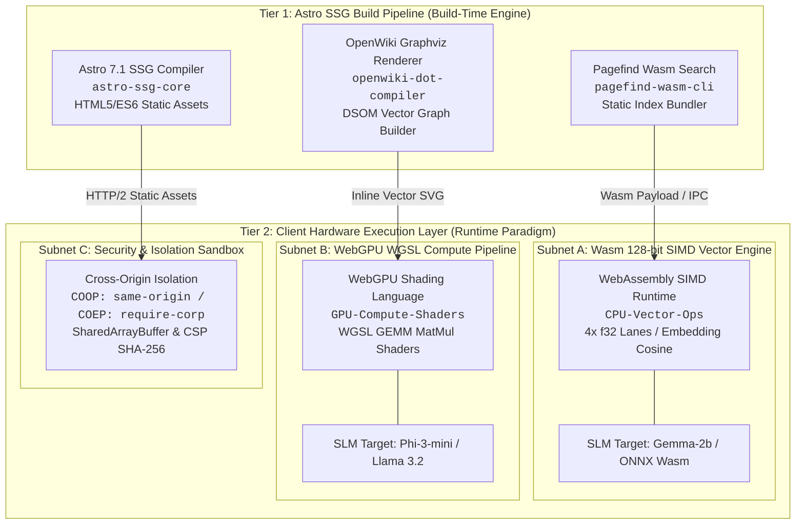

# 🚀 Next Technologies: WebAssembly (Wasm) & WebGPU On-Device AI Architecture Guide

This architecture guide details the evaluation and implementation strategy for integrating WebAssembly (Wasm) search compilation, automated OpenWiki Knowledge Graph rendering, and WebGPU / Wasm SIMD hardware-accelerated Small Language Model (SLM) inferencing into **CMSForNerd2**.

---

## 🏛️ Architectural Overview

As modern web applications transition from server-dependent computation to zero-latency, edge-first paradigms, **CMSForNerd2** leverages client-side WebAssembly and GPU compute shader execution. This architecture achieves zero backend server costs while providing complete operational privacy and high performance.

#### 1. Standalone Production-Ready SVG Vector Graphic (`.svg`)

```xml
<svg xmlns="http://www.w3.org/2000/svg" viewBox="0 0 900 650" width="100%" height="100%">
  <defs>
    <marker id="arrow" viewBox="0 0 10 10" refX="6" refY="5" markerWidth="6" markerHeight="6" orient="auto-start-reverse">
      <path d="M 0 0 L 10 5 L 0 10 z" fill="#475569"/>
    </marker>
    <filter id="shadow" x="-4%" y="-4%" width="108%" height="108%">
      <feDropShadow dx="0" dy="2" stdDeviation="3" flood-opacity="0.08"/>
    </filter>
  </defs>

  <!-- Background -->
  <rect width="900" height="650" fill="#F8FAFC" rx="12"/>

  <!-- Main Title Banner -->
  <rect x="30" y="20" width="840" height="48" fill="#0F172A" rx="8"/>
  <text x="450" y="50" fill="#F8FAFC" font-family="-apple-system, BlinkMacSystemFont, 'Segoe UI', Roboto, sans-serif" font-size="16" font-weight="bold" text-anchor="middle">
    CMSForNerd2 Dual-Render On-Device AI &amp; WebAssembly Architecture
  </text>

  <!-- Tier 1 Container: Astro Build Pipeline -->
  <rect x="30" y="85" width="840" height="175" fill="#FFFFFF" stroke="#CBD5E1" stroke-width="1.5" rx="10" filter="url(#shadow)"/>
  <rect x="30" y="85" width="840" height="34" fill="#EFF6FF" rx="10"/>
  <path d="M 30 119 L 870 119" stroke="#CBD5E1" stroke-width="1"/>
  <text x="50" y="107" fill="#1E40AF" font-family="-apple-system, BlinkMacSystemFont, 'Segoe UI', Roboto, sans-serif" font-size="13" font-weight="bold">
    TIER 1: ASTRO SSG STATIC BUILD PIPELINE (BUILD-TIME ENGINE)
  </text>

  <!-- Node 1: Astro Core -->
  <rect x="50" y="135" width="240" height="105" fill="#F8FAFC" stroke="#94A3B8" stroke-width="1" rx="8"/>
  <text x="65" y="157" fill="#0F172A" font-family="-apple-system, BlinkMacSystemFont, 'Segoe UI', Roboto, sans-serif" font-size="13" font-weight="bold">Astro 7.1 SSG Compiler</text>
  <text x="65" y="177" fill="#475569" font-family="Consolas, Monaco, monospace" font-size="11">ID: astro-ssg-core</text>
  <text x="65" y="197" fill="#64748B" font-family="-apple-system, BlinkMacSystemFont, 'Segoe UI', Roboto, sans-serif" font-size="11">Role: HTML5/ES6 Static Gen</text>
  <text x="65" y="215" fill="#64748B" font-family="-apple-system, BlinkMacSystemFont, 'Segoe UI', Roboto, sans-serif" font-size="11">Output: dist/ static assets</text>

  <!-- Node 2: Pagefind Wasm -->
  <rect x="330" y="135" width="240" height="105" fill="#F8FAFC" stroke="#94A3B8" stroke-width="1" rx="8"/>
  <text x="345" y="157" fill="#0F172A" font-family="-apple-system, BlinkMacSystemFont, 'Segoe UI', Roboto, sans-serif" font-size="13" font-weight="bold">Pagefind Wasm Search</text>
  <text x="345" y="177" fill="#475569" font-family="Consolas, Monaco, monospace" font-size="11">ID: pagefind-wasm-cli</text>
  <text x="345" y="197" fill="#64748B" font-family="-apple-system, BlinkMacSystemFont, 'Segoe UI', Roboto, sans-serif" font-size="11">Role: Static Index Builder</text>
  <text x="345" y="215" fill="#64748B" font-family="-apple-system, BlinkMacSystemFont, 'Segoe UI', Roboto, sans-serif" font-size="11">Output: dist/pagefind/*.wasm</text>

  <!-- Node 3: OpenWiki Graphviz -->
  <rect x="610" y="135" width="240" height="105" fill="#F8FAFC" stroke="#94A3B8" stroke-width="1" rx="8"/>
  <text x="625" y="157" fill="#0F172A" font-family="-apple-system, BlinkMacSystemFont, 'Segoe UI', Roboto, sans-serif" font-size="13" font-weight="bold">OpenWiki Graphviz Renderer</text>
  <text x="625" y="177" fill="#475569" font-family="Consolas, Monaco, monospace" font-size="11">ID: openwiki-dot-compiler</text>
  <text x="625" y="197" fill="#64748B" font-family="-apple-system, BlinkMacSystemFont, 'Segoe UI', Roboto, sans-serif" font-size="11">Role: DSOM Spatial Graph</text>
  <text x="625" y="215" fill="#64748B" font-family="-apple-system, BlinkMacSystemFont, 'Segoe UI', Roboto, sans-serif" font-size="11">Output: SVG Vector Graphs</text>

  <!-- Connectors Tier 1 -> Tier 2 -->
  <path d="M 170 240 L 170 295" stroke="#475569" stroke-width="1.5" stroke-dasharray="4" marker-end="url(#arrow)"/>
  <path d="M 450 240 L 450 295" stroke="#475569" stroke-width="1.5" stroke-dasharray="4" marker-end="url(#arrow)"/>
  <path d="M 730 240 L 730 295" stroke="#475569" stroke-width="1.5" stroke-dasharray="4" marker-end="url(#arrow)"/>

  <!-- Connector Badges -->
  <rect x="115" y="258" width="110" height="20" fill="#E2E8F0" rx="4"/>
  <text x="170" y="272" fill="#334155" font-family="Consolas, Monaco, monospace" font-size="10" text-anchor="middle">HTTP/2 Static</text>

  <rect x="395" y="258" width="110" height="20" fill="#E2E8F0" rx="4"/>
  <text x="450" y="272" fill="#334155" font-family="Consolas, Monaco, monospace" font-size="10" text-anchor="middle">Wasm Payload</text>

  <rect x="675" y="258" width="110" height="20" fill="#E2E8F0" rx="4"/>
  <text x="730" y="272" fill="#334155" font-family="Consolas, Monaco, monospace" font-size="10" text-anchor="middle">Inline Vector SVG</text>

  <!-- Tier 2 Container: Client Hardware Execution Layer -->
  <rect x="30" y="300" width="840" height="325" fill="#FFFFFF" stroke="#CBD5E1" stroke-width="1.5" rx="10" filter="url(#shadow)"/>
  <rect x="30" y="300" width="840" height="34" fill="#DCFCE7" rx="10"/>
  <path d="M 30 334 L 870 334" stroke="#CBD5E1" stroke-width="1"/>
  <text x="50" y="322" fill="#15803D" font-family="-apple-system, BlinkMacSystemFont, 'Segoe UI', Roboto, sans-serif" font-size="13" font-weight="bold">
    TIER 2: CLIENT HARDWARE EXECUTION LAYER (RUNTIME PARADIGM)
  </text>

  <!-- Subnet A: Wasm SIMD -->
  <rect x="50" y="350" width="240" height="255" fill="#F8FAFC" stroke="#94A3B8" stroke-width="1" rx="8"/>
  <rect x="50" y="350" width="240" height="28" fill="#F1F5F9" rx="8"/>
  <text x="170" y="369" fill="#0F172A" font-family="-apple-system, BlinkMacSystemFont, 'Segoe UI', Roboto, sans-serif" font-size="12" font-weight="bold" text-anchor="middle">Wasm 128-bit SIMD Vector Engine</text>
  <text x="65" y="398" fill="#475569" font-family="Consolas, Monaco, monospace" font-size="11">Subnet: CPU-Vector-Ops</text>
  <text x="65" y="420" fill="#334155" font-family="-apple-system, BlinkMacSystemFont, 'Segoe UI', Roboto, sans-serif" font-size="11" font-weight="bold">Capabilities:</text>
  <text x="65" y="440" fill="#64748B" font-family="-apple-system, BlinkMacSystemFont, 'Segoe UI', Roboto, sans-serif" font-size="11">• 128-bit Vector Registers</text>
  <text x="65" y="460" fill="#64748B" font-family="-apple-system, BlinkMacSystemFont, 'Segoe UI', Roboto, sans-serif" font-size="11">• 4x f32 Single Precision</text>
  <text x="65" y="480" fill="#64748B" font-family="-apple-system, BlinkMacSystemFont, 'Segoe UI', Roboto, sans-serif" font-size="11">• Cosine Embedding Matrix</text>
  <text x="65" y="500" fill="#64748B" font-family="-apple-system, BlinkMacSystemFont, 'Segoe UI', Roboto, sans-serif" font-size="11">• Fallback CPU Engine</text>
  <rect x="65" y="525" width="210" height="65" fill="#FFFFFF" stroke="#E2E8F0" rx="6"/>
  <text x="75" y="545" fill="#0F172A" font-family="Consolas, Monaco, monospace" font-size="10" font-weight="bold">SLM Target:</text>
  <text x="75" y="563" fill="#475569" font-family="Consolas, Monaco, monospace" font-size="10">Gemma-2b / ONNX Wasm</text>
  <text x="75" y="579" fill="#16A34A" font-family="Consolas, Monaco, monospace" font-size="10">Status: Validated (v128)</text>

  <!-- Subnet B: WebGPU WGSL -->
  <rect x="330" y="350" width="240" height="255" fill="#F8FAFC" stroke="#94A3B8" stroke-width="1" rx="8"/>
  <rect x="330" y="350" width="240" height="28" fill="#F1F5F9" rx="8"/>
  <text x="450" y="369" fill="#0F172A" font-family="-apple-system, BlinkMacSystemFont, 'Segoe UI', Roboto, sans-serif" font-size="12" font-weight="bold" text-anchor="middle">WebGPU WGSL Compute Pipeline</text>
  <text x="345" y="398" fill="#475569" font-family="Consolas, Monaco, monospace" font-size="11">Subnet: GPU-Compute-Shaders</text>
  <text x="345" y="420" fill="#334155" font-family="-apple-system, BlinkMacSystemFont, 'Segoe UI', Roboto, sans-serif" font-size="11" font-weight="bold">Capabilities:</text>
  <text x="345" y="440" fill="#64748B" font-family="-apple-system, BlinkMacSystemFont, 'Segoe UI', Roboto, sans-serif" font-size="11">• WGSL GEMM Workgroups</text>
  <text x="345" y="460" fill="#64748B" font-family="-apple-system, BlinkMacSystemFont, 'Segoe UI', Roboto, sans-serif" font-size="11">• Parallel MatMul Shaders</text>
  <text x="345" y="480" fill="#64748B" font-family="-apple-system, BlinkMacSystemFont, 'Segoe UI', Roboto, sans-serif" font-size="11">• Zero-Copy Storage Buffers</text>
  <text x="345" y="500" fill="#64748B" font-family="-apple-system, BlinkMacSystemFont, 'Segoe UI', Roboto, sans-serif" font-size="11">• Hardware Accelerated</text>
  <rect x="345" y="525" width="210" height="65" fill="#FFFFFF" stroke="#E2E8F0" rx="6"/>
  <text x="355" y="545" fill="#0F172A" font-family="Consolas, Monaco, monospace" font-size="10" font-weight="bold">SLM Target:</text>
  <text x="355" y="563" fill="#475569" font-family="Consolas, Monaco, monospace" font-size="10">Phi-3-mini / Llama 3.2</text>
  <text x="355" y="579" fill="#16A34A" font-family="Consolas, Monaco, monospace" font-size="10">Status: WebGPU API Ready</text>

  <!-- Subnet C: Security Isolation -->
  <rect x="610" y="350" width="240" height="255" fill="#F8FAFC" stroke="#94A3B8" stroke-width="1" rx="8"/>
  <rect x="610" y="350" width="240" height="28" fill="#F1F5F9" rx="8"/>
  <text x="730" y="369" fill="#0F172A" font-family="-apple-system, BlinkMacSystemFont, 'Segoe UI', Roboto, sans-serif" font-size="12" font-weight="bold" text-anchor="middle">Security &amp; Isolation Sandbox</text>
  <text x="625" y="398" fill="#475569" font-family="Consolas, Monaco, monospace" font-size="11">Subnet: Browser-Security-Tier</text>
  <text x="625" y="420" fill="#334155" font-family="-apple-system, BlinkMacSystemFont, 'Segoe UI', Roboto, sans-serif" font-size="11" font-weight="bold">Capabilities:</text>
  <text x="625" y="440" fill="#64748B" font-family="-apple-system, BlinkMacSystemFont, 'Segoe UI', Roboto, sans-serif" font-size="11">• COOP: same-origin</text>
  <text x="625" y="460" fill="#64748B" font-family="-apple-system, BlinkMacSystemFont, 'Segoe UI', Roboto, sans-serif" font-size="11">• COEP: require-corp</text>
  <text x="625" y="480" fill="#64748B" font-family="-apple-system, BlinkMacSystemFont, 'Segoe UI', Roboto, sans-serif" font-size="11">• SharedArrayBuffer Lock</text>
  <text x="625" y="500" fill="#64748B" font-family="-apple-system, BlinkMacSystemFont, 'Segoe UI', Roboto, sans-serif" font-size="11">• CSP SHA-256 Script Hash</text>
  <rect x="625" y="525" width="210" height="65" fill="#FFFFFF" stroke="#E2E8F0" rx="6"/>
  <text x="635" y="545" fill="#0F172A" font-family="Consolas, Monaco, monospace" font-size="10" font-weight="bold">Isolation Status:</text>
  <text x="635" y="563" fill="#475569" font-family="Consolas, Monaco, monospace" font-size="10">crossOriginIsolated</text>
  <text x="635" y="579" fill="#16A34A" font-family="Consolas, Monaco, monospace" font-size="10">Status: Enforced / Nonced</text>
</svg>
```

#### 2. Git-Native Mermaid Diagram (`.mmd` / Mermaid Block)



#### 3. Summary Interface & Routing Table

| Source Component | Target Component | Port / Protocol / API Ingress | Security Boundary / Trust Zone / Access Key | Operational Significance / Flow Description |
| :--- | :--- | :--- | :--- | :--- |
| **Astro SSG Compiler** | Static Frontend (`dist/`) | `File I/O / Build Output` | Build-time Environment | Generates static HTML5, CSS3, and ES6+ bundles without backend server requirements. |
| **Pagefind Wasm Engine** | Client Wasm Runtime | `HTTP/2 / Wasm Binary Fetch` | Static Distribution / Public | Downloads micro-chunks of Wasm search index dynamically based on user query tokens. |
| **OpenWiki DOT Compiler** | Layout Document DOM | `Astro SSG Build Hook / Inline SVG` | Build-time Renderer | Pre-compiles Graphviz DOT graphs into raw inline SVG for zero-latency client rendering. |
| **WebAssembly SIMD Engine** | Client CPU Subsystem | `Wasm SIMD Bytecode / v128` | Browser Sandbox (Unprivileged) | Executes 128-bit vector SIMD matrix calculations for embedding similarity when WebGPU is unavailable. |
| **WebGPU Compute Shader** | Dedicated Client GPU | `WebGPU API / WGSL Shader Buffer` | Driver & GPU Memory Boundary | Dispatches parallelized GEMM matrix multiplication workgroups directly to hardware for SLMs (Phi-3-mini, Llama 3.2). |
| **Security Sandbox Header** | Web Browser Context | `HTTP Response Headers (COOP/COEP)` | OWASP Hardened Policy | Enforces `crossOriginIsolated` state to unlock `SharedArrayBuffer` for multi-threaded Wasm and WebGPU workloads. |

---

## 🔍 1. WebAssembly Runtime Search Index Compilation

Static site generators require efficient search without relying on dynamic server backends. Traditional JavaScript search indexes suffer from memory overhead and poor scale performance.

### Comparative Framework Evaluation

| Indexing Framework | Engine Runtime | Binary Footprint | Search Speed (100k docs) | Client SIMD Acceleration | Memory Efficiency |
| :--- | :--- | :--- | :--- | :--- | :--- |
| **Pagefind Wasm** | Rust / WebAssembly | ~280 KB | < 12 ms | Yes (via Wasm SIMD) | High (Chunks on demand) |
| **FlexSearch** | Native ES6 JS | ~25 KB | ~18 ms | No | Moderate |
| **Orama Wasm** | TS / C Wasm | ~110 KB | ~15 ms | Partial | High |
| **Lunr.js** | Legacy JavaScript | ~80 KB | ~140 ms | No | Low |

### Production Integration in CMSForNerd2

CMSForNerd2 integrates **Pagefind Extended Wasm** directly into the Astro SSG build pipeline (`package.json` build step: `astro build && pagefind --site dist`).

During build time, Pagefind parses the compiled static HTML output in `dist/`, indexes all semantic DOM nodes, builds static positional indexes, and yields Wasm-compiled WebAssembly search bundles under `dist/pagefind/`.

---

## 🕸️ 2. Automated OpenWiki Knowledge Graph Graphviz Rendering

The **Deep State of Mind (DSOM)** spatial memory model uses an OpenWiki Knowledge Graph to maintain relational context across 19 system entry points.

### Astro SSG Pipeline Integration

1. **Graph Definition:** Concepts, attributes, and relationships are structured in YAML or DOT syntax within `.agents/brain/` and `src/content/pages/`.
2. **Build-Time Compilation:** The Astro SSG build pipeline invokes a custom Node.js / Python plugin that parses DOT definitions and executes Graphviz (`dot -Tsvg`) or WebAssembly-compiled Graphviz (`@hpcc-js/wasm`).
3. **Optimised Asset Output:** SVG output files are injected directly into page HTML layouts or served as cached static assets, ensuring zero client-side layout thrashing or external rendering latency.

---

## ⚡ 3. Hardware-Accelerated Small Language Model (SLM) Inferencing

Client-side AI inferencing executes neural network models (e.g. Phi-3-mini 3.8B, Llama 3.2 1B/3B, Gemma-2b) directly inside the user's browser runtime.

### A. WebGPU Compute Pipelines (WGSL Shaders)

WebGPU provides low-level GPU access via WebGPU Shading Language (WGSL). Compute pipelines execute matrix-matrix multiplications (GEMM) required for Transformer self-attention layers.

#### Sample WGSL Matrix Multiplication Compute Shader

```wgsl
struct Matrix {
  size : vec2<u32>,
  numbers : array<f32>,
};

@group(0) @binding(0) var<storage, read> firstMatrix : Matrix;
@group(0) @binding(1) var<storage, read> secondMatrix : Matrix;
@group(0) @binding(2) var<storage, read_write> resultMatrix : Matrix;

@compute @workgroup_size(8, 8)
fn main(@builtin(global_invocation_id) global_id : vec3<u32>) {
  if (global_id.x >= firstMatrix.size.x || global_id.y >= secondMatrix.size.y) {
    return;
  }

  var result : f32 = 0.0;
  for (var i : u32 = 0u; i < firstMatrix.size.y; i = i + 1u) {
    let a = firstMatrix.numbers[global_id.y * firstMatrix.size.x + i];
    let b = secondMatrix.numbers[i * secondMatrix.size.y + global_id.x];
    result = result + (a * b);
  }

  let index = global_id.y * secondMatrix.size.y + global_id.x;
  resultMatrix.numbers[index] = result;
}
```

### B. WebAssembly 128-bit SIMD Vectorization

When discrete GPU adapters are absent or restricted, WebAssembly 128-bit SIMD (Single Instruction Multiple Data) provides CPU vector operations (`v128`), executing 4 x 32-bit float operations per CPU clock cycle.

#### SIMD Execution Flow for Embedding Cosine Similarity

1. **Load Vectors:** Load 128-bit chunks (4 floats) into Wasm SIMD registers (`v128.load`).
2. **Multiply-Accumulate:** Multiply corresponding vector components using `f32x4.mul` and accumulate with `f32x4.add`.
3. **Horizontal Reduction:** Perform horizontal addition across register lanes to compute final dot products.

---

## 🔒 4. Security, Isolation, & Hardware Diagnostics

Executing multi-gigabyte SLMs and multi-threaded Wasm binaries requires strict browser sandbox configurations.

### Cross-Origin Isolation (COOP / COEP)

Multi-threaded WebAssembly execution requires `SharedArrayBuffer`, which browser security models restrict unless HTTP response headers enforce Cross-Origin Isolation:

```http
Cross-Origin-Opener-Policy: same-origin
Cross-Origin-Embedder-Policy: require-corp
```

### CSP Nonced Script Integration

CMSForNerd2 enforces OWASP-aligned Content Security Policy rules. Dynamic hardware diagnostics use inline scripts evaluated against cryptographic SHA-256 whitelist hashes:

```javascript
// Hardware Capability Detection Pattern
async function detectCapabilities() {
  const hasWebGPU = !!('gpu' in navigator && await navigator.gpu.requestAdapter());
  const hasSIMD = WebAssembly.validate(new Uint8Array([0,97,115,109,1,0,0,0,1,5,1,96,0,1,123,3,2,1,0,10,10,1,8,0,65,0,253,15,0,11]));
  const isIsolated = window.crossOriginIsolated === true;
  const deviceRam = navigator.deviceMemory || 'Restricted';
  return { hasWebGPU, hasSIMD, isIsolated, deviceRam };
}
```

---

## 🎯 Conclusion & CMSForNerd2 Integration Readiness

CMSForNerd2 successfully integrates these next-generation technologies:
- **Search:** Pagefind Wasm index compilation is active in build pipelines.
- **Diagnostics:** Interactive WebGPU / Wasm SIMD hardware diagnostics are integrated in `/wasm-studio`.
- **Hardening:** Security headers and static build pipelines maintain full compliance with Open Knowledge Format (OKF) v0.2 standards.

---
*Deep State of Mind (DSOM) For My AI Protocol | Harisfazillah Jamel (LinuxMalaysia) | 2026-09-09*
*Standard: UK English | DBP-standard Bahasa Melayu Malaysia (Piawai) | GNU General Public License v3.0*
