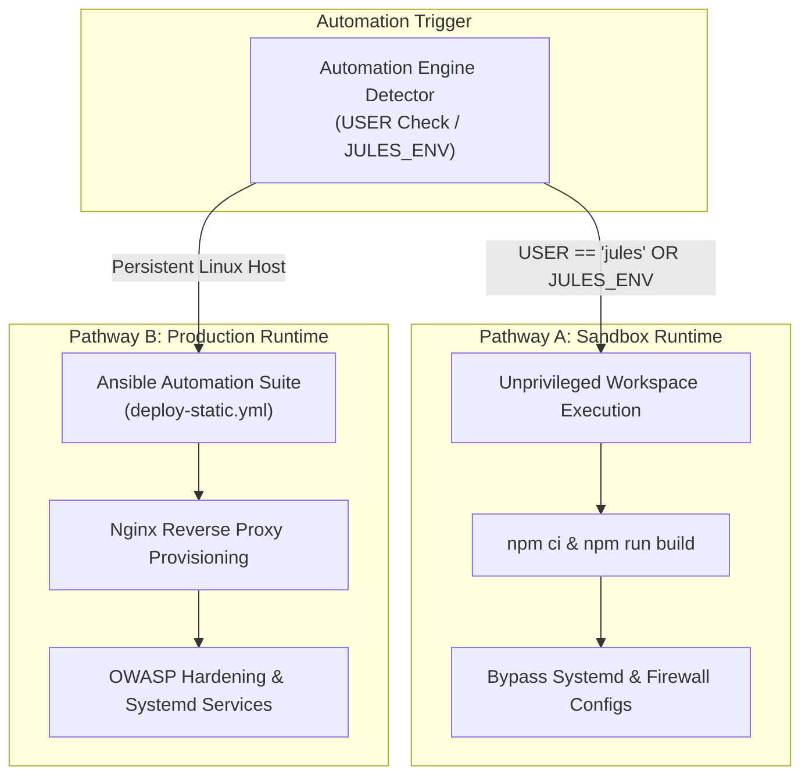

# 🧠 Spatial Memory & Dual-Pathway Design

This document describes the architectural theory and conceptual principles governing **Sovereign AI Agent Memory**, **Google Jules Sandbox Limitations**, and **Dual-Pathway Automation** within the CMSForNerd2 project.

---

## 🏛️ Deep State of Mind (DSOM) Spatial Memory

Unlike traditional software development where operational rules and context exist only in the human mind, the CMSForNerd2 project uses the **Deep State of Mind (DSOM)** cognitive protocol.

Under DSOM, AI agents (like Google Jules) and human developers share a synchronized, Git-native memory model:

1. **Rulebook Synchronization**: Core rules are fully synchronized between `AGENTS.md` and `.agents/AGENTS.md`. These rulebooks act as the "constitution" of the repository, setting coding standards, language rules, and verification pathways.
2. **Zero-Global Operational Memory**: Active context, tasks, and historical mental anchors are recorded in Markdown format inside `.agents/brain/` (`task.md`, `walkthrough.md`, `knowledge.md`).
3. **Self-Contained Discovery**: By establishing spatial memories within the repository, agents can instantly restore context on subsequent runs without relying on external, stateful API databases.

---

## 🔒 Google Jules Sandbox Constraints

When executing inside the Google Jules workspace, automation tasks run under specialized unprivileged virtual machine constraints:

- **No Persistent OS Modifications**: Though passwordless `sudo` is configured, there is no persistent init/systemd system. Changes made outside the workspace directory are discarded when the container finishes running.
- **Headless Execution**: No physical or virtual display server exists, meaning visual validation (like Playwright browser tests) must run in strict headless mode.
- **Transient VM Lifecycle**: The sandbox environment is transient.

---

## 🚀 Dual-Pathway Automation Principle

To prevent build failures and environment blocks under restricted sandboxes, all shell scripts, deployment tools, and Ansible orchestration playbooks follow the **Dual-Pathway Automation Principle**.

#### 1. ASCII Tree Diagram

```
                             ┌───────────────────────┐
                             │  AUTOMATION TRIGGER   │
                             │ deploy-static.sh      │
                             └───────────┬───────────┘
                                         │
                          Is $USER == "jules" or JULES_ENV?
                          ┌──────────────┴──────────────┐
                         YES                            NO
                          │                             │
                          ▼                             ▼
               ┌─────────────────────┐       ┌─────────────────────┐
               │ Pathway A: Sandbox  │       │ Pathway B: Real OS  │
               ├─────────────────────┤       ├─────────────────────┤
               │ • Unprivileged SSG  │       │ • Full Ansible Suite│
               │ • npm ci & build    │       │ • Systemd & Nginx   │
               │ • Skip Systemd/Root │       │ • OWASP Hardening   │
               └─────────────────────┘       └─────────────────────┘
```

#### 2. Standalone Dark Slate Raw SVG Vector Graphic (`.svg`)

```xml
<svg xmlns="http://www.w3.org/2000/svg" viewBox="0 0 800 400" width="100%" height="100%">
  <defs>
    <marker id="arrow" viewBox="0 0 10 10" refX="6" refY="5" markerWidth="6" markerHeight="6" orient="auto-start-reverse">
      <path d="M 0 0 L 10 5 L 0 10 z" fill="#94A3B8"/>
    </marker>
  </defs>

  <rect width="100%" height="100%" fill="#0F172A" rx="12"/>

  <text x="400" y="35" text-anchor="middle" fill="#C084FC" font-family="-apple-system, sans-serif" font-size="16" font-weight="bold" letter-spacing="1">DUAL-PATHWAY AUTOMATION PRINCIPLE ARCHITECTURE</text>

  <rect x="250" y="60" width="300" height="65" rx="10" fill="#1E293B" stroke="#334155" stroke-width="2"/>
  <rect x="250" y="60" width="300" height="24" rx="10" fill="#334155"/>
  <text x="400" y="77" text-anchor="middle" fill="#F8FAFC" font-family="-apple-system, sans-serif" font-size="12" font-weight="bold">AUTOMATION ENGINE DETECTOR</text>
  <text x="400" y="102" text-anchor="middle" fill="#E2E8F0" font-family="Consolas, monospace" font-size="11">USER == "jules" || JULES_ENV</text>

  <path d="M 320 125 L 200 175" stroke="#94A3B8" stroke-width="2" marker-end="url(#arrow)"/>
  <path d="M 480 125 L 600 175" stroke="#94A3B8" stroke-width="2" marker-end="url(#arrow)"/>

  <rect x="210" y="140" width="80" height="22" rx="11" fill="#38BDF8"/>
  <text x="250" y="155" text-anchor="middle" fill="#0F172A" font-family="Consolas, monospace" font-size="10" font-weight="bold">YES (Sandbox)</text>

  <rect x="510" y="140" width="80" height="22" rx="11" fill="#4ADE80"/>
  <text x="550" y="155" text-anchor="middle" fill="#0F172A" font-family="Consolas, monospace" font-size="10" font-weight="bold">NO (Real OS)</text>

  <rect x="50" y="175" width="300" height="190" rx="10" fill="#1E293B" stroke="#38BDF8" stroke-width="2"/>
  <rect x="50" y="175" width="300" height="28" rx="10" fill="#0284C7"/>
  <text x="200" y="194" text-anchor="middle" fill="#FFFFFF" font-family="-apple-system, sans-serif" font-size="12" font-weight="bold">PATHWAY A: UNPRIVILEGED SANDBOX</text>
  <text x="70" y="225" fill="#F8FAFC" font-family="-apple-system, sans-serif" font-size="12">Target: <tspan fill="#38BDF8" font-family="Consolas, monospace">Google Jules Sandbox VM</tspan></text>
  <text x="70" y="250" fill="#E2E8F0" font-family="-apple-system, sans-serif" font-size="11">• Executed inside unprivileged workspace</text>
  <text x="70" y="275" fill="#E2E8F0" font-family="-apple-system, sans-serif" font-size="11">• Runs local npm ci &amp; npm run build</text>
  <text x="70" y="300" fill="#E2E8F0" font-family="-apple-system, sans-serif" font-size="11">• Bypasses systemd and firewall updates</text>
  <text x="70" y="325" fill="#E2E8F0" font-family="-apple-system, sans-serif" font-size="11">• Guarantees zero transient build blocks</text>

  <rect x="450" y="175" width="300" height="190" rx="10" fill="#1E293B" stroke="#4ADE80" stroke-width="2"/>
  <rect x="450" y="175" width="300" height="28" rx="10" fill="#15803D"/>
  <text x="600" y="194" text-anchor="middle" fill="#FFFFFF" font-family="-apple-system, sans-serif" font-size="12" font-weight="bold">PATHWAY B: PRODUCTION HOST</text>
  <text x="470" y="225" fill="#F8FAFC" font-family="-apple-system, sans-serif" font-size="12">Target: <tspan fill="#4ADE80" font-family="Consolas, monospace">Staging / Production Linux Host</tspan></text>
  <text x="470" y="250" fill="#E2E8F0" font-family="-apple-system, sans-serif" font-size="11">• Launches full Ansible deploy-static.yml</text>
  <text x="470" y="275" fill="#E2E8F0" font-family="-apple-system, sans-serif" font-size="11">• Configures Nginx reverse proxy routing</text>
  <text x="470" y="300" fill="#E2E8F0" font-family="-apple-system, sans-serif" font-size="11">• Applies OWASP security header suite</text>
  <text x="470" y="325" fill="#E2E8F0" font-family="-apple-system, sans-serif" font-size="11">• Manages persistent systemd web services</text>
</svg>
```

#### 3. Git-Native Mermaid Diagram (`.mmd`)



#### 4. Summary Interface & Routing Table

| Source Component | Target Component | Ingress / Protocol | Trust Zone / Security Boundary | Operational Significance / Flow Description |
| :--- | :--- | :--- | :--- | :--- |
| Automation Detector | Pathway A: Sandbox Engine | Local Shell Execution | Unprivileged VM (`jules`) | Runs unprivileged static builds and tests locally, bypassing system-level configuration changes. |
| Automation Detector | Pathway B: Production Engine | `ansible-playbook` CLI | Staging / Production Server | Executes full Ansible orchestration to configure web servers, firewalls, and system services with full privileges. |

---

### Pathway A: Sandbox-Safe Unprivileged Builds

If the execution user is detected as `jules` (or `JULES_ENV` is present), the tool skips system-level alterations (such as modifying firewalls, copying system files, or running administrative package managers). It runs local workspace builds inside the unprivileged directory using standard user commands.

### Pathway B: Production System Orchestration

When executing on a persistent staging or production server, the engine launches the full Ansible playbook (`deploy-static.yml`), allowing administrative system configurations, secure Nginx reverse proxy routing, and cryptographic whitelisting.

By separating unprivileged compilation from server provisioning, we guarantee that the build pipeline remains portable, robust, and safe across different running environments.

---
*Deep State of Mind (DSOM) For My AI Protocol | Harisfazillah Jamel (LinuxMalaysia) | 2026-09-08*
*Standard: UK English | DBP-standard Bahasa Melayu Malaysia (Piawai) | GNU General Public License v3.0*
