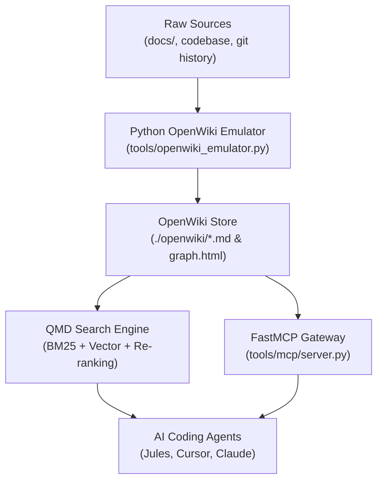

# 🌐 How to Adopt OpenWiki via Native Python Emulator & QMD Search Helper

This guide explains how to adopt the **OpenWiki** knowledge graph standard in your project using a lightweight, native Python emulator (`tools/openwiki_emulator.py`) driven by `uv`, replacing heavy Node.js dependencies (`openwiki` npm package) while integrating Andrej Karpathy's **LLM Wiki** paradigm, **QMD (Query Markup Documents)** local search helper, and reusable AI prompts to reproduce this implementation.

---

## 1. Why Replace Node.js OpenWiki with Python `uv` Emulator?

The official OpenWiki Node.js implementation (`@langchain-ai/openwiki` / `openwiki`) introduces heavy binary dependencies, npm package bloat, and external API rate limit constraints that are unsuitable for lightweight, sovereign AI agent environments.

### Key Rationale:

1. **Zero External Binaries:** Eliminates global npm binary installations and JavaScript dependency trees.
2. **`uv` Single-Binary Management:** Executes via `uv run --with pyyaml python tools/openwiki_emulator.py`, ensuring instantaneous, reproducible execution across Linux, macOS, and Windows.
3. **Offline & Air-Gapped Sovereignty:** Requires no cloud API keys, external SaaS calls, or network access to compile, search, and visualize knowledge graphs.
4. **OKF v0.2 Frontmatter Native Compliance:** Automatically formats all compiled concept pages with machine-readable OKF v0.2 headers and trust signals.

---

## 2. Integration Architecture: Karpathy LLM Wiki, QMD & FastMCP

The Python OpenWiki implementation unifies three core knowledge paradigm layers:



### A. Karpathy's LLM Wiki Paradigm (Ingest, Query, Lint)

Following Andrej Karpathy's LLM Wiki philosophy:
- **Ingest:** Instead of raw RAG on every turn, incoming changes in code or Git commits are parsed, summarized, and filed into interlinked Markdown pages under `./openwiki/`.
- **Query:** AI agents query the interlinked wiki rather than scanning raw code files repeatedly.
- **Lint:** `tools/openwiki_emulator.py` validates frontmatter metadata, checks link integrity, and performs in-place self-healing on Mermaid diagram blocks.

### B. QMD (Query Markup Documents) Local Search Engine

[QMD](https://github.com/tobi/qmd) is an on-device search engine for Markdown notes and documentation combining BM25 keyword search, vector semantic search, and local LLM re-ranking.

- **Indexing:**
  ```bash
  qmd index ./openwiki ./docs
  ```
- **Querying:**
  ```bash
  qmd query "ansible inventory topology"
  ```
- **Built-in Fallback:** When QMD is not present, `tools/openwiki_emulator.py --search "<query>"` provides instant, zero-dependency OKF frontmatter search.

---

## 3. Operational Guide & Commands

The native Python emulator provides four primary CLI actions:

```bash
# 1. Initialize and compile full openwiki/ directory and pages
uv run --with pyyaml python tools/openwiki_emulator.py --init

# 2. Compile recent Git status and diffs into evidence blocks
uv run --with pyyaml python tools/openwiki_emulator.py --update

# 3. Perform fast OKF metadata search across openwiki pages
uv run --with pyyaml python tools/openwiki_emulator.py --search "ansible"

# 4. Generate standalone offline HTML graph visualizer (openwiki/graph.html)
uv run --with pyyaml python tools/openwiki_emulator.py --export-graph
```

---

## 4. Mermaid Diagram Syntax Validation & Self-Healing

The emulator incorporates a zero-dependency Mermaid diagram validator:

1. **Validation Checks:** Verifies diagram headers (`flowchart`, `sequenceDiagram`, `erDiagram`, etc.), quote balancing, and bracket pairing.
2. **In-place Degradation:** Invalid diagrams are safely commented with `%% openwiki-error: <reason>` to prevent static site generator compilation failures.
3. **In-place Self-healing:** When syntax errors are fixed in degraded blocks, the emulator automatically detects the fix and recovers the block back to active ````mermaid````.

---

## 5. Reusable AI Prompts to Reproduce Session Task

You can copy and paste these exact AI prompts to instruct any AI pair-programmer (Jules, Cursor, Claude Code, OpenCode) to recreate or adopt this setup in any codebase:

### Prompt 1: Initial OpenWiki Python Emulator Adoption Prompt

```text
Please adopt the OpenWiki knowledge graph standard in this repository using a native Python script instead of OpenWiki Node.js, because Node.js packages are too heavy for our project.

Requirements:
1. Create `tools/openwiki_emulator.py` executable via `uv run --with pyyaml python tools/openwiki_emulator.py`.
2. Implement CLI options: `--init` (builds ./openwiki/ folder, _skeleton.md, INSTRUCTIONS.md, .last-update.json, graph.html, quickstart.md, and subsystem pages), `--update` (compiles git status), `--search` (OKF frontmatter search), and `--export-graph` (standalone offline graph HTML).
3. Ensure all generated Markdown files contain valid OKF v0.2 frontmatter headers starting at line 1, column 1.
4. Include zero-dependency Mermaid diagram syntax validation with in-place degradation (%% openwiki-error:) and automatic self-healing recovery.
5. Reference Karpathy's LLM Wiki (Ingest, Query, Lint) and QMD (Query Markup Documents - https://github.com/tobi/qmd) local search engine integration in INSTRUCTIONS.md.
6. Create an Agent Skill under `skills/openwiki-compiler/SKILL.md` and `.agents/skills/openwiki-compiler/SKILL.md` documenting the procedural SOP for running the emulator via `uv`.
7. Add Pytest unit tests in `tests/unit/openwiki.py` (re-exported in `tests/test_unit.py`) to verify CLI commands, frontmatter headers, and Mermaid diagram self-healing.
8. Document the implementation in `docs/how-to/openwiki-python-compiler-guide.md`.
```

### Prompt 2: Incremental Maintenance & EOD Sync Prompt

```text
Execute End-of-Day (EOD) OpenWiki Knowledge Graph consolidation:
1. Run `uv run --with pyyaml python tools/openwiki_emulator.py --update` to compile recent Git diffs into evidence blocks.
2. Verify that all `./openwiki/` pages pass OKF v0.2 frontmatter checks and Mermaid diagram self-healing.
3. Run `qmd index ./openwiki ./docs` or `uv run --with pyyaml python tools/openwiki_emulator.py --search "active-topic"` to confirm searchability.
```

---

*Deep State of Mind (DSOM) For My AI Protocol | Harisfazillah Jamel (LinuxMalaysia) & Jules | 2026-10-04*
*Standard: UK English | DBP-standard Bahasa Melayu Malaysia (Piawai) | GNU General Public License v3.0*
