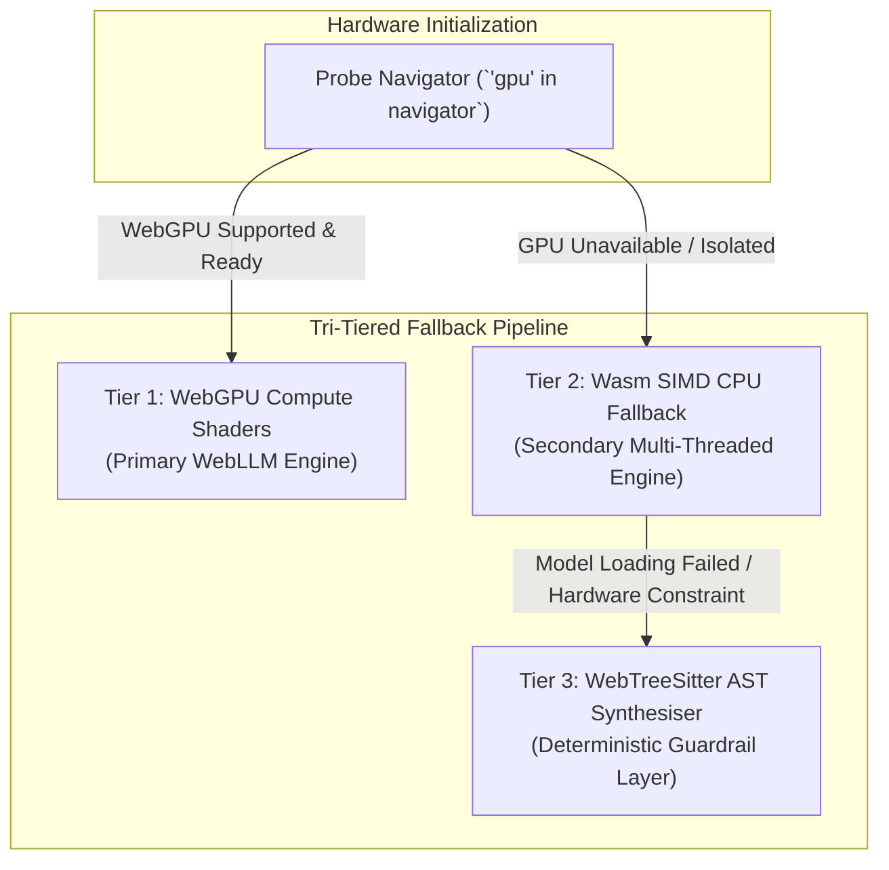

# Building WebGPU Applications on CMSForNerd2

This guide provides a complete developer manual and step-by-step implementation framework for building modern, air-gapped web applications powered by **WebGPU** hardware acceleration on top of **CMSForNerd2**.

---

## 1. WebGPU Architecture in CMSForNerd2

CMSForNerd2 leverages WebGPU to deliver low-latency, 100% offline, privacy-preserving artificial intelligence directly within the user's web browser. By executing quantized LLM tensors (`Llama-3.2-1B-Instruct-q4f16`, `Qwen2.5-0.5B-Instruct-q4f16`) via GPU compute shaders, web applications achieve high-throughput inference without server backends or network data transmission.

### Tri-Tiered Ensemble Pipeline Architecture

#### 1. ASCII Tree Diagram

```
                              ┌──────────────────────────┐
                              │    User Hardware Request  │
                              └────────────┬─────────────┘
                                           │
                                  Capability Probe
                                           │
             ┌─────────────────────────────┼─────────────────────────────┐
             ▼                             ▼                             ▼
  ┌──────────────────────┐      ┌──────────────────────┐      ┌──────────────────────┐
  │ Tier 1: WebGPU       │      │ Tier 2: Wasm SIMD    │      │ Tier 3: AST Guardrail│
  │ Hardware Accelerator │      │ Multi-Thread CPU     │      │ Rule-Based Synthesiser│
  └──────────────────────┘      └──────────────────────┘      └──────────────────────┘
```

#### 2. Standalone Dark Slate Raw SVG Vector Graphic (`.svg`)

```xml
<svg xmlns="http://www.w3.org/2000/svg" viewBox="0 0 800 360" width="100%" height="100%">
  <defs>
    <marker id="arrow" viewBox="0 0 10 10" refX="6" refY="5" markerWidth="6" markerHeight="6" orient="auto-start-reverse">
      <path d="M 0 0 L 10 5 L 0 10 z" fill="#94A3B8"/>
    </marker>
  </defs>

  <rect width="100%" height="100%" fill="#0F172A" rx="12"/>

  <text x="400" y="35" text-anchor="middle" fill="#38BDF8" font-family="-apple-system, sans-serif" font-size="16" font-weight="bold" letter-spacing="1">WEBGPU TRI-TIERED ENSEMBLE FALLBACK ARCHITECTURE</text>

  <!-- Probe Node -->
  <rect x="250" y="60" width="300" height="50" rx="8" fill="#1E293B" stroke="#38BDF8" stroke-width="2"/>
  <text x="400" y="90" text-anchor="middle" fill="#FFFFFF" font-family="-apple-system, sans-serif" font-size="12" font-weight="bold">HARDWARE CAPABILITY PROBE ('gpu' in navigator)</text>

  <!-- Branch Lines -->
  <path d="M 300 110 L 150 160" stroke="#94A3B8" stroke-width="2" marker-end="url(#arrow)"/>
  <path d="M 400 110 L 400 160" stroke="#94A3B8" stroke-width="2" marker-end="url(#arrow)"/>
  <path d="M 500 110 L 650 160" stroke="#94A3B8" stroke-width="2" marker-end="url(#arrow)"/>

  <!-- Tier 1 -->
  <rect x="30" y="160" width="220" height="150" rx="8" fill="#1E293B" stroke="#4ADE80" stroke-width="2"/>
  <rect x="30" y="160" width="220" height="28" rx="8" fill="#15803D"/>
  <text x="140" y="179" text-anchor="middle" fill="#FFFFFF" font-family="-apple-system, sans-serif" font-size="11" font-weight="bold">TIER 1: WEBGPU PRIMARY</text>
  <text x="140" y="210" text-anchor="middle" fill="#F8FAFC" font-family="-apple-system, sans-serif" font-size="11">GPU Compute Shaders</text>
  <text x="140" y="230" text-anchor="middle" fill="#E2E8F0" font-family="Consolas, monospace" font-size="10">WebLLM Matrix Tensors</text>
  <text x="140" y="260" text-anchor="middle" fill="#4ADE80" font-family="-apple-system, sans-serif" font-size="11" font-weight="bold">High Throughput (~42 t/s)</text>
  <text x="140" y="285" text-anchor="middle" fill="#94A3B8" font-family="-apple-system, sans-serif" font-size="10">Zero Network Leakage</text>

  <!-- Tier 2 -->
  <rect x="290" y="160" width="220" height="150" rx="8" fill="#1E293B" stroke="#FBBF24" stroke-width="2"/>
  <rect x="290" y="160" width="220" height="28" rx="8" fill="#B45309"/>
  <text x="400" y="179" text-anchor="middle" fill="#FFFFFF" font-family="-apple-system, sans-serif" font-size="11" font-weight="bold">TIER 2: WASM SIMD CPU</text>
  <text x="400" y="210" text-anchor="middle" fill="#F8FAFC" font-family="-apple-system, sans-serif" font-size="11">Multi-Thread CPU Fallback</text>
  <text x="400" y="230" text-anchor="middle" fill="#E2E8F0" font-family="Consolas, monospace" font-size="10">128-bit Vector Registers</text>
  <text x="400" y="260" text-anchor="middle" fill="#FBBF24" font-family="-apple-system, sans-serif" font-size="11" font-weight="bold">Moderate (~12 t/s)</text>
  <text x="400" y="285" text-anchor="middle" fill="#94A3B8" font-family="-apple-system, sans-serif" font-size="10">Restricted GPU Adapters</text>

  <!-- Tier 3 -->
  <rect x="550" y="160" width="220" height="150" rx="8" fill="#1E293B" stroke="#C084FC" stroke-width="2"/>
  <rect x="550" y="160" width="220" height="28" rx="8" fill="#6B21A8"/>
  <text x="660" y="179" text-anchor="middle" fill="#FFFFFF" font-family="-apple-system, sans-serif" font-size="11" font-weight="bold">TIER 3: AST SYNTHESISER</text>
  <text x="660" y="210" text-anchor="middle" fill="#F8FAFC" font-family="-apple-system, sans-serif" font-size="11">WebTreeSitter AST Engine</text>
  <text x="660" y="230" text-anchor="middle" fill="#E2E8F0" font-family="Consolas, monospace" font-size="10">Deterministic Parsing</text>
  <text x="660" y="260" text-anchor="middle" fill="#C084FC" font-family="-apple-system, sans-serif" font-size="11" font-weight="bold">Instant Repair (&lt;2ms)</text>
  <text x="660" y="285" text-anchor="middle" fill="#94A3B8" font-family="-apple-system, sans-serif" font-size="10">Structural Code Repair</text>
</svg>
```

#### 3. Git-Native Mermaid Diagram (`.mmd`)



#### 4. Summary Interface & Routing Table

| Tier Layer | Runtime Engine | Primary Use Case | Hardware Requirement | Fallback Trigger |
| :--- | :--- | :--- | :--- | :--- |
| **Tier 1 (Primary)** | `@mlc-ai/web-llm` over WebGPU | Quantized LLM inference & RAG synthesis | Modern GPU compute adapter (`navigator.gpu`) | WebGPU adapter absent or origin isolation disabled |
| **Tier 2 (Fallback)** | WebAssembly 128-bit SIMD | Multi-threaded CPU LLM inference | Multi-core CPU with Wasm SIMD support | Model memory allocation overflow or GPU driver timeout |
| **Tier 3 (Guardrail)** | `web-tree-sitter` WASM AST | Structural syntax parsing & deterministic repairs | Standard browser JS runtime | Complete LLM engine unreachability or offline emergency |

---

## 2. Hardware Capability Detection & Setup

Before initializing WebGPU inference pipelines, your application must inspect client browser capabilities and report fallback states to the user.

### Detecting WebGPU and Memory Boundaries

```javascript
/**
 * Probes browser capabilities for WebGPU, Wasm 128-bit SIMD, and cross-origin isolation.
 * @returns {Promise<Object>} Status report containing capability booleans and recommendations.
 */
async function inspectWebGPUCapabilities() {
  const hasWebGPU = ('gpu' in navigator);
  let adapterInfo = null;

  if (hasWebGPU) {
    try {
      const adapter = await navigator.gpu.requestAdapter();
      if (adapter) {
        adapterInfo = await adapter.requestAdapterInfo();
      }
    } catch (err) {
      console.warn('WebGPU adapter request failed:', err);
    }
  }

  const hasSIMD = typeof WebAssembly === 'object' && typeof WebAssembly.validate === 'function' &&
    WebAssembly.validate(new Uint8Array([0,97,115,109,1,0,0,0,1,5,1,96,0,1,123,3,2,1,0,10,10,1,8,0,65,0,253,15,26,11]));

  const isIsolated = window.crossOriginIsolated === true;
  const deviceMemory = navigator.deviceMemory || 'Unrestricted';

  return {
    hasWebGPU: Boolean(hasWebGPU && adapterInfo),
    adapterName: adapterInfo ? adapterInfo.description || adapterInfo.vendor : 'Unavailable',
    hasSIMD,
    isIsolated,
    deviceMemory: typeof deviceMemory === 'number' ? `${deviceMemory} GB` : deviceMemory,
    recommendedTier: (hasWebGPU && adapterInfo) ? 'Tier 1: WebGPU' : (hasSIMD ? 'Tier 2: Wasm SIMD' : 'Tier 3: AST Synthesiser')
  };
}
```

---

## 3. WebLLM Integration & Air-Gapped RAG Workflow

CMSForNerd2 pairs WebLLM (`@mlc-ai/web-llm`) with an in-browser vector embedding store (`WasmStudioVectorDB`) to deliver grounded, offline RAG synthesis.

### Step 1: Initializing the WebLLM Engine

```javascript
import { CreateMLCEngine } from '@mlc-ai/web-llm';

let engine = null;
const SELECTED_MODEL = 'Llama-3.2-1B-Instruct-q4f16-MLC';

/**
 * Initializes the WebGPU WebLLM engine with progress callbacks.
 * @param {Function} onProgress Progress callback reporting model download and setup status.
 */
async function initWebGPUEngine(onProgress) {
  try {
    engine = await CreateMLCEngine(SELECTED_MODEL, {
      initProgressCallback: (progress) => {
        if (onProgress) onProgress(progress.text, progress.progress);
      }
    });
    console.log('✅ WebGPU LLM Engine successfully loaded.');
  } catch (err) {
    console.error('Tier 1 WebGPU initialization failed. Falling back to Tier 2 Wasm SIMD:', err);
    // Execute fallback logic here
  }
}
```

### Step 2: Extracting Local Vector Context (IndexedDB)

```javascript
/**
 * Computes cosine similarity between query embedding and stored document vectors.
 * @param {Float32Array} queryVector 384-dimensional query vector.
 * @param {Array<Object>} storedRecords IndexedDB vector records.
 * @returns {Array<Object>} Top-K matched documents.
 */
function retrieveRAGContext(queryVector, storedRecords, topK = 3) {
  return storedRecords.map(doc => {
    let dot = 0, normA = 0, normB = 0;
    for (let i = 0; i < queryVector.length; i++) {
      dot += queryVector[i] * doc.vector[i];
      normA += queryVector[i] * queryVector[i];
      normB += doc.vector[i] * doc.vector[i];
    }
    const similarity = dot / (Math.sqrt(normA) * Math.sqrt(normB) + 1e-9);
    return { ...doc, similarity };
  })
  .sort((a, b) => b.similarity - a.similarity)
  .slice(0, topK);
}
```

### Step 3: Generating Air-Gapped RAG Synthesis

```javascript
/**
 * Synthesises grounded response using WebGPU LLM engine and local RAG context.
 * @param {string} userQuery User prompt.
 * @param {Array<Object>} contextDocs Matched local context documents.
 * @returns {Promise<string>} Synthesised answer string.
 */
async function generateAirGappedSynthesis(userQuery, contextDocs) {
  if (!engine) throw new Error('WebGPU Engine not initialized.');

  const contextText = contextDocs.map(d => `[Source: ${d.title}]\n${d.content}`).join('\n\n');

  const messages = [
    { role: 'system', content: 'You are an air-gapped security AI assistant running 100% locally on WebGPU. Answer questions strictly using the provided context.' },
    { role: 'user', content: `Context:\n${contextText}\n\nQuestion: ${userQuery}` }
  ];

  const response = await engine.chat.completions.create({
    messages,
    temperature: 0.2,
    max_tokens: 512
  });

  return response.choices[0].message.content;
}
```

---

## 4. Security Headers & Performance Guardrails

### 1. Nginx Cross-Origin Isolation (COOP & COEP)

To allow WebGPU memory sharing and multi-threaded Wasm `SharedArrayBuffer` allocation without security warnings, your Nginx web server must emit cross-origin isolation headers.

Ensure `nginx/nginx.conf` includes:

```nginx
# Enable Cross-Origin Isolation for WebGPU and Wasm SharedArrayBuffer
add_header Cross-Origin-Opener-Policy "same-origin" always;
add_header Cross-Origin-Embedder-Policy "require-corp" always;
add_header Cross-Origin-Resource-Policy "cross-origin" always;

# Static asset immutable caching for Wasm binaries and WebGPU models
location ~* \.(wasm|bin|onnx)$ {
    add_header Cache-Control "public, max-age=31536000, immutable";
    add_header Access-Control-Allow-Origin "*";
}
```

### 2. CSP SHA-256 Nonce Whitelisting

When using inline WebGPU canvas renderers or script blocks in CMSForNerd2, calculate script SHA-256 digests via `/wasm-studio` and whitelist them inside your Nginx Content Security Policy:

```nginx
add_header Content-Security-Policy "default-src 'self'; script-src 'self' 'wasm-unsafe-eval' 'sha256-47DEQpj8HBSa+/TImW+5JCeuQeRkm5NMpJWZG3hSuFU='; style-src 'self' 'unsafe-inline'; worker-src 'self' blob:; img-src 'self' data:;";
```

---

## 5. Verification & Testing Framework

CMSForNerd2 includes automated E2E and unit tests for WebGPU workflows in `tests/test_e2e.py`.

Run the test suite locally to verify WebGPU integration:

```bash
# Execute Pytest validation suite
PYTHONPATH=. pytest tests/test_e2e.py -k test_wasm_studio_interactive_workflows
```

---
*Deep State of Mind (DSOM) For My AI Protocol | Harisfazillah Jamel (LinuxMalaysia) | 2026-09-08*
*Standard: UK English | DBP-standard Bahasa Melayu Malaysia (Piawai) | GNU General Public License v3.0*
