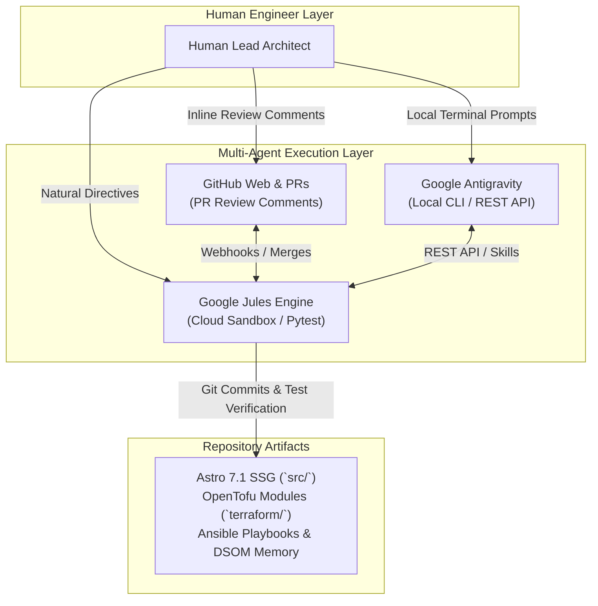

# Autonomous AI Pair-Programming & Multi-Agent Operations with Google Jules

Welcome to the official technical showcase and operational guide for **Google Jules**—the autonomous AI coding agent—and its seamless integration across our software development lifecycle, OpenTofu infrastructure provisioning, Ansible configuration management, and multi-agent coordination with Google Antigravity.

This guide chronicles the complete lifecycle of how we bootstrapped, refactored, tested, and published this repository (`CMSForNerd2`). It details the human-agent collaborative engineering model, demonstrating how developer review comments on GitHub Pull Requests (PRs) drive autonomous task continuation, code refactoring, context preservation, and zero-friction delivery.

---

## 1. Overview & Engineering Philosophy

### The Vision: Sovereign IaC, Static Site Modernisation, & Multi-Agent Synergy

Modern software and cloud engineering require rapid iteration without sacrificing governance, security, or operational determinism. Our architectural vision unites four fundamental pillars:

1. **Sovereign Infrastructure as Code (IaC):** Modular, deterministic OpenTofu manifestations paired with Ansible playbooks utilizing Fully Qualified Collection Names (FQCN) to deliver complete infrastructure control across cloud and rootless on-premises Podman environments.
2. **Static Site Modernisation:** Modernising legacy, dynamic systems into lightning-fast, secure Astro Static Site Generator (SSG) architectures published automatically via GitHub Pages and containerised Nginx deployments.
3. **Deep State of Mind (DSOM) Governance:** A metacognitive governance framework enforcing persistent spatial memory, zero context decay, and human-in-the-loop verification across all agent interactions.
4. **Multi-Agent Pair-Programming Synergy:** An operational ecosystem where Google Jules acts as an autonomous senior co-engineer in the cloud, working side-by-side with human engineers on GitHub PRs, while Google Antigravity orchestrates local CLI operations and task delegations.

#### 1. ASCII Tree Diagram

```
                              ┌────────────────────────┐
                              │ HUMAN ENGINEER / ARCH  │
                              └───────────┬────────────┘
                                          │
                  ┌───────────────────────┼───────────────────────┐
                  ▼                       ▼                       ▼
       ┌─────────────────────┐ ┌─────────────────────┐ ┌─────────────────────┐
       │ GitHub Web & PRs    │ │ Google Jules Engine │ │ Google Antigravity  │
       │ (PR Comments & Diff)│ │ (API / Web Console) │ │ (Local CLI / Skills)│
       └──────────┬──────────┘ └──────────┬──────────┘ └──────────┬──────────┘
                  │                       │                       │
                  └───────────────────────┼───────────────────────┘
                                          │
                                          ▼
                      ┌───────────────────────────────────────┐
                      │ REPOSITORY ARTIFACTS & INFRASTRUCTURE │
                      │ • Astro 7.1 SSG Framework (`src/`)     │
                      │ • OpenTofu Modules (`terraform/`)     │
                      │ • Ansible Hardening & Playbooks       │
                      │ • DSOM Memory (`.agents/brain/`)      │
                      └───────────────────────────────────────┘
```

#### 2. Standalone Dark Slate Raw SVG Vector Graphic (`.svg`)

```xml
<svg xmlns="http://www.w3.org/2000/svg" viewBox="0 0 800 380" width="100%" height="100%">
  <defs>
    <marker id="arrow" viewBox="0 0 10 10" refX="6" refY="5" markerWidth="6" markerHeight="6" orient="auto-start-reverse">
      <path d="M 0 0 L 10 5 L 0 10 z" fill="#94A3B8"/>
    </marker>
  </defs>

  <rect width="100%" height="100%" fill="#0F172A" rx="12"/>

  <text x="400" y="35" text-anchor="middle" fill="#60A5FA" font-family="-apple-system, sans-serif" font-size="16" font-weight="bold" letter-spacing="1">HUMAN-AGENT PAIR-PROGRAMMING ARCHITECTURE</text>

  <!-- Human Engineer -->
  <rect x="250" y="60" width="300" height="50" rx="10" fill="#1E293B" stroke="#FBBF24" stroke-width="2"/>
  <rect x="250" y="60" width="300" height="20" rx="10" fill="#B45309"/>
  <text x="400" y="75" text-anchor="middle" fill="#FFFFFF" font-family="-apple-system, sans-serif" font-size="11" font-weight="bold">HUMAN LEAD ARCHITECT</text>
  <text x="400" y="98" text-anchor="middle" fill="#F8FAFC" font-family="-apple-system, sans-serif" font-size="11">Strategic Guidance &amp; Code Review</text>

  <!-- Connectors -->
  <path d="M 300 110 L 150 160" stroke="#94A3B8" stroke-width="2" marker-end="url(#arrow)"/>
  <path d="M 400 110 L 400 160" stroke="#94A3B8" stroke-width="2" marker-end="url(#arrow)"/>
  <path d="M 500 110 L 650 160" stroke="#94A3B8" stroke-width="2" marker-end="url(#arrow)"/>

  <!-- Tier 2 Nodes -->
  <rect x="30" y="160" width="220" height="80" rx="8" fill="#1E293B" stroke="#38BDF8" stroke-width="1.5"/>
  <rect x="30" y="160" width="220" height="20" rx="8" fill="#0284C7"/>
  <text x="140" y="175" text-anchor="middle" fill="#FFFFFF" font-family="-apple-system, sans-serif" font-size="10" font-weight="bold">GITHUB WEB &amp; PRS</text>
  <text x="140" y="200" text-anchor="middle" fill="#F8FAFC" font-family="-apple-system, sans-serif" font-size="10">PR Review Threads</text>
  <text x="140" y="220" text-anchor="middle" fill="#94A3B8" font-family="Consolas, monospace" font-size="9">Git Diff / Webhooks</text>

  <rect x="290" y="160" width="220" height="80" rx="8" fill="#1E293B" stroke="#4ADE80" stroke-width="1.5"/>
  <rect x="290" y="160" width="220" height="20" rx="8" fill="#15803D"/>
  <text x="400" y="175" text-anchor="middle" fill="#FFFFFF" font-family="-apple-system, sans-serif" font-size="10" font-weight="bold">GOOGLE JULES ENGINE</text>
  <text x="400" y="200" text-anchor="middle" fill="#F8FAFC" font-family="-apple-system, sans-serif" font-size="10">Autonomous Coding Agent</text>
  <text x="400" y="220" text-anchor="middle" fill="#94A3B8" font-family="Consolas, monospace" font-size="9">Cloud Sandbox / Pytest</text>

  <rect x="550" y="160" width="220" height="80" rx="8" fill="#1E293B" stroke="#C084FC" stroke-width="1.5"/>
  <rect x="550" y="160" width="220" height="20" rx="8" fill="#6B21A8"/>
  <text x="660" y="175" text-anchor="middle" fill="#FFFFFF" font-family="-apple-system, sans-serif" font-size="10" font-weight="bold">GOOGLE ANTIGRAVITY</text>
  <text x="660" y="200" text-anchor="middle" fill="#F8FAFC" font-family="-apple-system, sans-serif" font-size="10">Local CLI Assistant</text>
  <text x="660" y="220" text-anchor="middle" fill="#94A3B8" font-family="Consolas, monospace" font-size="9">Agent Skills / REST API</text>

  <!-- Flow to Repository Artifacts -->
  <path d="M 140 240 L 140 270 L 400 270 L 400 280" stroke="#94A3B8" stroke-width="1.5"/>
  <path d="M 400 240 L 400 280" stroke="#94A3B8" stroke-width="1.5" marker-end="url(#arrow)"/>
  <path d="M 660 240 L 660 270 L 400 270 L 400 280" stroke="#94A3B8" stroke-width="1.5"/>

  <!-- Repository Artifacts Box -->
  <rect x="50" y="280" width="700" height="80" rx="10" fill="#1E293B" stroke="#60A5FA" stroke-width="2"/>
  <rect x="50" y="280" width="700" height="24" rx="10" fill="#1D4ED8"/>
  <text x="400" y="297" text-anchor="middle" fill="#FFFFFF" font-family="-apple-system, sans-serif" font-size="11" font-weight="bold">REPOSITORY-WIDE ARTIFACTS &amp; INFRASTRUCTURE</text>
  <text x="400" y="325" text-anchor="middle" fill="#F8FAFC" font-family="-apple-system, sans-serif" font-size="11">Astro 7.1 SSG (`src/`) • OpenTofu IaC (`terraform/`) • Ansible Hardening • DSOM Memory (`.agents/brain/`)</text>
  <text x="400" y="345" text-anchor="middle" fill="#60A5FA" font-family="Consolas, monospace" font-size="10">Deterministic Git Versioning &amp; Automated CI/CD Pipelines</text>
</svg>
```

#### 3. Git-Native Mermaid Diagram (`.mmd`)



#### 4. Summary Interface & Routing Table

| Source Component | Target Component | Ingress / Protocol | Trust Zone / Security Boundary | Operational Significance / Flow Description |
| :--- | :--- | :--- | :--- | :--- |
| Human Architect | GitHub PRs / Jules | HTTPS / Webhooks | GitHub OAuth / TLS 1.3 | Issues review comments and directives to drive autonomous task continuation. |
| Google Jules Engine | Repository Core | Git HTTPS / SSH | Cloud Sandbox VM | Refactors code, executes test suites, and pushes clean verified commits to target branches. |

---

### Core Value Delivery: Reducing MTTD/MTTR & Operational Toil

Integrating Google Jules directly into our Git pipeline fundamentally transformed our engineering productivity and developer experience:

* **Drastic Reduction in MTTD/MTTR:** Mean Time to Detect and Resolve build errors or configuration drifts decreased from hours to minutes. Jules inspects diagnostic outputs, executes local test suites (`pytest`, `tofu validate`, `npm run build`), pinpointing root causes and pushing targeted Git merge diffs directly.
* **Context Retention across Sessions:** Unlike traditional ephemeral LLM chat interfaces that reset state between prompts, Jules maintains project context through spatial memory, branch tracking, and repository governance rules defined in `AGENTS.md` and `.agents/brain/`.
* **Elimination of Operational Toil:** Jules autonomously manages tedious chores—updating multi-host sitemaps, refactoring Open Knowledge Format (OKF) frontmatter, running validation scripts, and maintaining complete alignment between source code and technical documentation.

---

## 2. Step-by-Step Build & Implementation Log

This chronicle details the exact sequence of engineering milestones executed collaboratively between the human lead architect and Google Jules to build this repository from scratch.

### Milestone 1: Repository Scaffolding & Astro SSG Setup

1. **Initial Bootstrap:** Established repository structure containing `src/`, `docs/`, `tools/`, `inventory/`, and root-level governance files.
2. **Astro 7.1 Integration:** Configured `astro.config.mjs` with MDX support, explicit subpath deployment routing for GitHub Pages (`base: process.env.GITHUB_ACTIONS ? '/CMSForNerd2' : '/'`), and strict dependency pinning in `package.json`.
3. **Automated CI/CD Pipeline:** Authored `.github/workflows/deploy-gh-pages.yml` to compile static assets using Node.js v22 and publish the generated `dist/` directory directly to GitHub Pages.

### Milestone 2: Authoring Sovereign Infrastructure with OpenTofu

1. **Infrastructure Declarations:** Formulated OpenTofu module definitions for cloud resource orchestration:
   * Security group rules enforcing strict ingress boundaries.
   * Auto Scaling Launch Templates enforcing Instance Metadata Service Version 2 (`IMDSv2`) with `http_tokens = "required"`.
   * High-availability database topologies and serverless caching configurations.
2. **Validation Automation:** Established local verification hooks using `tofu init -backend=false && tofu validate` to ensure syntactical accuracy prior to Git commits.

### Milestone 3: Configuration Management Baseline via Ansible

1. **Privilege Separation:** Developed FQCN-compliant Ansible playbooks (`deploy-static.yml`) implementing strict privilege separation between rootful system tuning (`become: yes`) and unprivileged workspace operations.
2. **Dual-Pathway Sandbox Adaptations:** Engineered adaptive branching logic in Ansible playbooks to automatically detect unprivileged sandbox environments (e.g., Google Jules container) and bypass systemd or firewall operations, focusing strictly on local file compilation and static verification.

### Milestone 4: DSOM Protocol & Spatial Memory Integration

1. **Spatial Memory Architecture (`.agents/brain/`):** Implemented permanent memory ledgers (`task.md`, `walkthrough.md`, `implementation_plan.md`, `palace_registry.md`) to index architectural decisions and track project evolution across sessions.
2. **Modular Agent Skills (`.agents/skills/`):** Created specialised AI agent skill modules (`static-security-hardening`, `github-pages-deployment`, `render-deployment`, `dsom-cognitive-protocol`, etc.) conforming to OKF v0.2 and Google Antigravity specifications.
3. **Dual `AGENTS.md` Gateway:** Configured `AGENTS.md` at the repository root as the primary entry point for Jules and external agents, redirecting to `.agents/AGENTS.md` for the comprehensive sovereign rulebook.

---

## 3. Collaborative Engineering via GitHub PR Comments

The defining feature of Google Jules is its ability to engage in natural, iterative pair-programming directly within GitHub Pull Request review threads.

```
+-----------------------------------------------------------------+
|                       GITHUB PULL REQUEST                       |
+-----------------------------------------------------------------+
   |                                                           ^
   | 1. Human engineer leaves inline PR comment                | 4. Jules pushes code
   |    "Please refactor the Astro config for IMDSv2 / base"   |    commit & replies
   v                                                           |
+-----------------------------------------------------------------+
|                   GOOGLE JULES AGENT ENGINE                     |
|  - Parses comment thread & active branch diff                   |
|  - Ingests spatial memory (`.agents/brain/`)                    |
|  - Executes targeted edits (`replace_with_git_merge_diff`)      |
|  - Runs test suites (`pytest`, `npm run build`, `verify`)       |
+-----------------------------------------------------------------+
```

---

## 5. Deep State of Mind (DSOM) Governance & Spatial Memory

To guarantee that AI models produce deterministic, policy-compliant outputs without context decay, we integrated the **Deep State of Mind (DSOM) for My AI** framework into this repository.

### The Three Pillars of DSOM

#### 1. ASCII Tree Diagram

```
┌─────────────────────────────────────────────────────┐
│                 DSOM OPERATING MODEL                │
│                                                     │
│  ┌──────────┐   ┌──────────┐   ┌─────────────────┐  │
│  │  AIOps   │──▶│  GitOps  │──▶│  The Executor   │  │
│  │  (Mind)  │   │ (Record) │   │     (Hand)      │  │
│  └──────────┘   └──────────┘   └─────────────────┘  │
│       │               │                 │           │
│  AI proposes    Git records     Executor runs       │
│  & analyses     all state       on target nodes     │
│       ▲               │                 │           │
│       └───────────────┴─── AI verifies ─┘           │
└─────────────────────────────────────────────────────┘
```

#### 2. Standalone Dark Slate Raw SVG Vector Graphic (`.svg`)

```xml
<svg xmlns="http://www.w3.org/2000/svg" viewBox="0 0 800 320" width="100%" height="100%">
  <defs>
    <marker id="arrow" viewBox="0 0 10 10" refX="6" refY="5" markerWidth="6" markerHeight="6" orient="auto-start-reverse">
      <path d="M 0 0 L 10 5 L 0 10 z" fill="#94A3B8"/>
    </marker>
  </defs>

  <rect width="100%" height="100%" fill="#0F172A" rx="12"/>

  <text x="400" y="35" text-anchor="middle" fill="#C084FC" font-family="-apple-system, sans-serif" font-size="16" font-weight="bold" letter-spacing="1">DEEP STATE OF MIND (DSOM) OPERATING MODEL</text>

  <!-- Container Cards -->
  <rect x="40" y="70" width="210" height="120" rx="10" fill="#1E293B" stroke="#38BDF8" stroke-width="1.5"/>
  <rect x="40" y="70" width="210" height="24" rx="10" fill="#0284C7"/>
  <text x="145" y="87" text-anchor="middle" fill="#FFFFFF" font-family="-apple-system, sans-serif" font-size="11" font-weight="bold">1. AIOPS (MIND)</text>
  <text x="145" y="120" text-anchor="middle" fill="#F8FAFC" font-family="-apple-system, sans-serif" font-size="12" font-weight="bold">AI Analysis &amp; Plans</text>
  <text x="145" y="145" text-anchor="middle" fill="#E2E8F0" font-family="-apple-system, sans-serif" font-size="10">Proposes code changes &amp; edits</text>

  <path d="M 250 130 L 295 130" stroke="#94A3B8" stroke-width="2" marker-end="url(#arrow)"/>

  <rect x="295" y="70" width="210" height="120" rx="10" fill="#1E293B" stroke="#4ADE80" stroke-width="1.5"/>
  <rect x="295" y="70" width="210" height="24" rx="10" fill="#15803D"/>
  <text x="400" y="87" text-anchor="middle" fill="#FFFFFF" font-family="-apple-system, sans-serif" font-size="11" font-weight="bold">2. GITOPS (RECORD)</text>
  <text x="400" y="120" text-anchor="middle" fill="#F8FAFC" font-family="-apple-system, sans-serif" font-size="12" font-weight="bold">Git Version Control</text>
  <text x="400" y="145" text-anchor="middle" fill="#E2E8F0" font-family="-apple-system, sans-serif" font-size="10">Records state &amp; spatial memory</text>

  <path d="M 505 130 L 550 130" stroke="#94A3B8" stroke-width="2" marker-end="url(#arrow)"/>

  <rect x="550" y="70" width="210" height="120" rx="10" fill="#1E293B" stroke="#FBBF24" stroke-width="1.5"/>
  <rect x="550" y="70" width="210" height="24" rx="10" fill="#B45309"/>
  <text x="655" y="87" text-anchor="middle" fill="#FFFFFF" font-family="-apple-system, sans-serif" font-size="11" font-weight="bold">3. EXECUTOR (HAND)</text>
  <text x="655" y="120" text-anchor="middle" fill="#F8FAFC" font-family="-apple-system, sans-serif" font-size="12" font-weight="bold">Verification Engine</text>
  <text x="655" y="145" text-anchor="middle" fill="#E2E8F0" font-family="-apple-system, sans-serif" font-size="10">Runs Pytest, builds &amp; linter</text>

  <!-- Feedback Loop Path -->
  <path d="M 655 190 L 655 240 L 145 240 L 145 190" stroke="#C084FC" stroke-width="2" stroke-dasharray="4 4" marker-end="url(#arrow)"/>
  <rect x="330" y="228" width="140" height="24" rx="12" fill="#6B21A8"/>
  <text x="400" y="244" text-anchor="middle" fill="#FFFFFF" font-family="-apple-system, sans-serif" font-size="10" font-weight="bold">Verification Feedback Loop</text>
</svg>
```

#### 3. Git-Native Mermaid Diagram (`.mmd`)

```mermaid
graph LR
    subgraph Mind ["Pillar 1: AIOps"]
        A1["AIOps (Mind)<br/>(AI Analysis &amp; Plans)"]
    end

    subgraph Record ["Pillar 2: GitOps"]
        G1["GitOps (Record)<br/>(Git State &amp; Spatial Memory)"]
    end

    subgraph Hand ["Pillar 3: The Executor"]
        E1["The Executor (Hand)<br/>(Pytest, Build, Linter)"]
    end

    A1 -->|"Proposes code edits"| G1
    G1 -->|"Records state in Git"| E1
    E1 -.->"Verification Feedback Loop"| A1
```

#### 4. Summary Interface & Routing Table

| Source Component | Target Component | Ingress / Protocol | Trust Zone / Security Boundary | Operational Significance / Flow Description |
| :--- | :--- | :--- | :--- | :--- |
| AIOps (Mind) | GitOps (Record) | Git Commits / Diffs | Repository Workspace | Transforms natural language intent into structured code edits and spatial memory updates. |
| The Executor (Hand) | AIOps (Mind) | Test Logs / Diagnostic Output | Local Sandbox Engine | Executes test suites (`pytest`, `npm run build`), providing diagnostic feedback to refine code. |

---

### Spatial Memory Ledger (`.agents/brain/`)

Rather than losing context when chat windows close, Jules reads and updates permanent Markdown memory anchors:

* `task.md`: Real-time active task checklist.
* `walkthrough.md`: Historical decision log and Mental Anchors tracking session progress.
* `implementation_plan.md`: Long-term engineering roadmap.
* `palace_registry.md`: Spatial memory map indexing repository knowledge rooms.

---

## 6. Verification & Quality Gates

To verify this guide and ensure codebase integrity:

```bash
# 1. Format and normalize OKF YAML frontmatter
node tools/refactor-okf.cjs

# 2. Build Astro SSG static site
npm run build

# 3. Verify sitemap and internal link integrity
node tools/verify-sitemaps.js

# 4. Execute Pytest suite
python3 -m pytest -v tests/test_cms.py
```

---

*Deep State of Mind (DSOM) For My AI Protocol | Harisfazillah Jamel (LinuxMalaysia) | 2026-09-08*
*Standard: UK English | DBP-standard Bahasa Melayu Malaysia (Piawai) | GNU General Public License v3.0*
