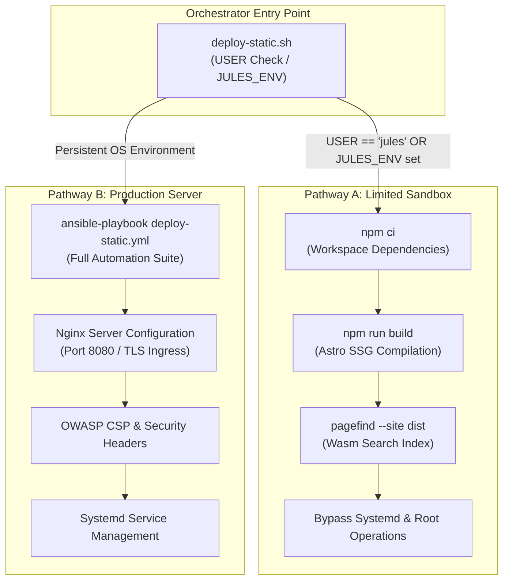

# 🏗️ `deploy-static.sh` CLI Reference

The `deploy-static.sh` script is a POSIX-compliant Bash orchestrator that automates static site builds and staging server deployments using dual-pathway environment branching.

---

## ⚙️ Technical Specifications

- **File Path**: `tools/deploy-static.sh`
- **Language**: POSIX-compliant Bash (tested with Bash 4.0+)
- **Dependencies**:
  - Node.js & npm (for workspace builds)
  - Ansible & `ansible-playbook` (optional, required only on Real OS deployments)

---

## 🛠️ Execution Pathways

The script executes a dynamic environmental check to determine available system privileges across limited sandbox and production server runtimes.

#### 1. ASCII Tree Diagram

```
                              ┌───────────────────┐
                              │    START RUN      │
                              │ deploy-static.sh  │
                              └─────────┬─────────┘
                                        │
                         Is USER == "jules" or $JULES_ENV?
                         ┌──────────────┴──────────────┐
                        YES                            NO
                         │                             │
                         ▼                             ▼
              ┌─────────────────────┐       ┌─────────────────────┐
              │  Pathway A: Sandbox │       │ Pathway B: Real OS  │
              │  Unprivileged SSG   │       │ Ansible Deploy      │
              ├─────────────────────┤       ├─────────────────────┤
              │ • npm ci            │       │ • deploy-static.yml │
              │ • npm run build     │       │ • Nginx Web Server  │
              │ • Bypass systemd    │       │ • Hardened Headers  │
              └─────────────────────┘       └─────────────────────┘
```

#### 2. Standalone Dark Slate Raw SVG Vector Graphic (`.svg`)

```xml
<svg xmlns="http://www.w3.org/2000/svg" viewBox="0 0 800 420" width="100%" height="100%">
  <defs>
    <marker id="arrow" viewBox="0 0 10 10" refX="6" refY="5" markerWidth="6" markerHeight="6" orient="auto-start-reverse">
      <path d="M 0 0 L 10 5 L 0 10 z" fill="#94A3B8"/>
    </marker>
  </defs>

  <!-- Dark Slate Background Canvas -->
  <rect width="100%" height="100%" fill="#0F172A" rx="12"/>

  <!-- Section Title -->
  <text x="400" y="35" text-anchor="middle" fill="#60A5FA" font-family="-apple-system, sans-serif" font-size="16" font-weight="bold" letter-spacing="1">DEPLOY-STATIC DUAL-PATHWAY EXECUTION ARCHITECTURE</text>

  <!-- Container: Orchestrator Ingress -->
  <rect x="250" y="60" width="300" height="70" rx="10" fill="#1E293B" stroke="#334155" stroke-width="2"/>
  <rect x="250" y="60" width="300" height="24" rx="10" fill="#334155"/>
  <text x="400" y="77" text-anchor="middle" fill="#F8FAFC" font-family="-apple-system, sans-serif" font-size="12" font-weight="bold">ORCHESTRATOR ENTRY POINT</text>
  <text x="400" y="105" text-anchor="middle" fill="#E2E8F0" font-family="-apple-system, sans-serif" font-size="13" font-weight="bold">deploy-static.sh</text>
  <text x="400" y="120" text-anchor="middle" fill="#94A3B8" font-family="Consolas, monospace" font-size="10">USER Check / JULES_ENV</text>

  <!-- Connectors from Orchestrator -->
  <path d="M 330 130 L 200 180" stroke="#94A3B8" stroke-width="2" marker-end="url(#arrow)"/>
  <path d="M 470 130 L 600 180" stroke="#94A3B8" stroke-width="2" marker-end="url(#arrow)"/>

  <!-- Decision Badges -->
  <rect x="210" y="145" width="80" height="22" rx="11" fill="#38BDF8"/>
  <text x="250" y="160" text-anchor="middle" fill="#0F172A" font-family="Consolas, monospace" font-size="10" font-weight="bold">YES (Sandbox)</text>

  <rect x="510" y="145" width="80" height="22" rx="11" fill="#4ADE80"/>
  <text x="550" y="160" text-anchor="middle" fill="#0F172A" font-family="Consolas, monospace" font-size="10" font-weight="bold">NO (Real OS)</text>

  <!-- Container: Sandbox Pathway -->
  <rect x="50" y="180" width="300" height="200" rx="10" fill="#1E293B" stroke="#38BDF8" stroke-width="2"/>
  <rect x="50" y="180" width="300" height="28" rx="10" fill="#0284C7"/>
  <text x="200" y="199" text-anchor="middle" fill="#FFFFFF" font-family="-apple-system, sans-serif" font-size="12" font-weight="bold">PATHWAY A: LIMITED SANDBOX</text>
  <text x="70" y="230" fill="#F8FAFC" font-family="-apple-system, sans-serif" font-size="12" font-weight="bold">Runtime: <tspan fill="#38BDF8" font-family="Consolas, monospace">Google Jules VM</tspan></text>
  <text x="70" y="255" fill="#E2E8F0" font-family="-apple-system, sans-serif" font-size="11">• Installs workspace dependencies (npm ci)</text>
  <text x="70" y="280" fill="#E2E8F0" font-family="-apple-system, sans-serif" font-size="11">• Compiles Astro SSG site (npm run build)</text>
  <text x="70" y="305" fill="#E2E8F0" font-family="-apple-system, sans-serif" font-size="11">• Generates Pagefind Wasm search index</text>
  <text x="70" y="330" fill="#E2E8F0" font-family="-apple-system, sans-serif" font-size="11">• Bypasses systemd and root configurations</text>
  <text x="70" y="355" fill="#4ADE80" font-family="Consolas, monospace" font-size="11">Status: Unprivileged Build Success</text>

  <!-- Container: Real OS Pathway -->
  <rect x="450" y="180" width="300" height="200" rx="10" fill="#1E293B" stroke="#4ADE80" stroke-width="2"/>
  <rect x="450" y="180" width="300" height="28" rx="10" fill="#15803D"/>
  <text x="600" y="199" text-anchor="middle" fill="#FFFFFF" font-family="-apple-system, sans-serif" font-size="12" font-weight="bold">PATHWAY B: PRODUCTION SERVER</text>
  <text x="470" y="230" fill="#F8FAFC" font-family="-apple-system, sans-serif" font-size="12">Runtime: <tspan fill="#4ADE80" font-family="Consolas, monospace">Linux Host / Staging</tspan></text>
  <text x="470" y="255" fill="#E2E8F0" font-family="-apple-system, sans-serif" font-size="11">• Triggers Ansible playbook (deploy-static.yml)</text>
  <text x="470" y="280" fill="#E2E8F0" font-family="-apple-system, sans-serif" font-size="11">• Provisions Nginx reverse proxy server</text>
  <text x="470" y="305" fill="#E2E8F0" font-family="-apple-system, sans-serif" font-size="11">• Configures OWASP CSP &amp; security headers</text>
  <text x="470" y="330" fill="#E2E8F0" font-family="-apple-system, sans-serif" font-size="11">• Manages systemd web service daemons</text>
  <text x="470" y="355" fill="#4ADE80" font-family="Consolas, monospace" font-size="11">Status: Full Infrastructure Provisioned</text>
</svg>
```

#### 3. Git-Native Mermaid Diagram (`.mmd`)



#### 4. Summary Interface & Routing Table

| Source Component | Target Component | Ingress / Protocol | Trust Zone / Security Boundary | Operational Significance / Flow Description |
| :--- | :--- | :--- | :--- | :--- |
| `deploy-static.sh` | Sandbox Build Engine | Local Shell CLI | Unprivileged VM (`jules`) | Executes workspace dependency installation and Astro static site generation without requiring root system access. |
| `deploy-static.sh` | Ansible Playbook Engine | `ansible-playbook` CLI | Staging / Production OS | Triggers `deploy-static.yml` to configure system Nginx servers, OWASP security headers, and systemd services. |

---

## 📥 Inputs & 📤 Outputs

- **Environment Variables**:
  - `JULES_ENV` (string, optional): If set, forces the orchestrator into Sandbox Mode.
  - `USER` (string, system): Read by the orchestrator to detect unprivileged runtimes.
- **Exit Codes**:
  - `0`: Successful compilation or deployment.
  - `1`: Missing command-line dependencies (such as `ansible-playbook` in Real OS mode).

---
*Deep State of Mind (DSOM) For My AI Protocol | Harisfazillah Jamel (LinuxMalaysia) | 2026-09-08*
*Standard: UK English | DBP-standard Bahasa Melayu Malaysia (Piawai) | GNU General Public License v3.0*
