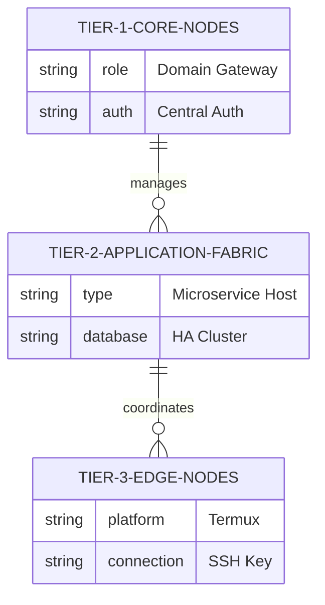

# Ansible Baseline & Automation Fabric Specification

The Execution Pillar of DSOM relies on a declarative and idempotent automation fabric driven by **Ansible**, ensuring all operations are repeatable and zero-binary.

## 🎛️ Inventory Architecture & Tiers

