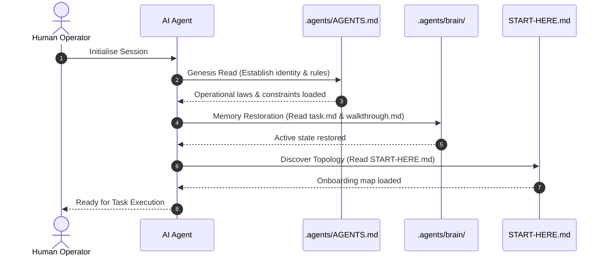

# Dual Agent Registry & Sovereign Operational Laws

To ensure immediate discovery by various platform LLM interfaces, DSOM enforces a dual-layered constitutional registry that anchors the agent's behaviour.

## 📜 The Dual AGENTS.md Registry

1. **The Root Gateway (`AGENTS.md`):**
   - Placed at the workspace root as a discoverable landing page for platform-integrated agents.

2. **The Sovereign Constitution (`.agents/AGENTS.md`):**
   - Located securely within the `.agents/` control directory.
   - Houses the complete 27 operational rules and execution constraints.

## ⚙️ The Mechanical Boot Sequence

