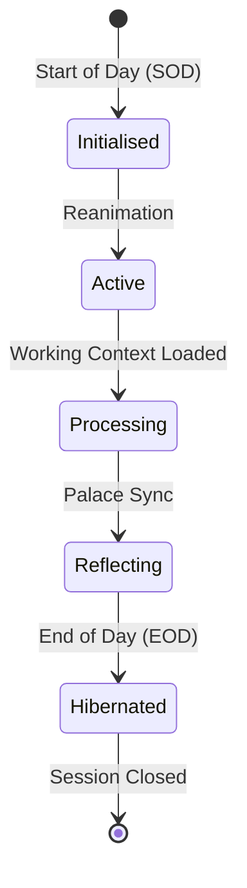

# Session Memory Stratification & Palace Synchronisation

Context decay is the single largest point of failure in Human-AI collaborative engineering. DSOM eliminates this through spatial memory stratification and strict session rituals.

## 🧠 Session State Lifecycle

## 🧠 Spatial Memory & Brain Artifacts

Active state tracking resides within the `.agents/brain/` directory:
- `task.md` — Houses active, pending, and completed tasks.
- `walkthrough.md` — Records session histories and dated Mental Anchors.
- `active_context_manifest.md` — Specifies exact files in active scope.
- `palace_registry.md` — Index of Sovereign Markdown Palace rooms mapping to `docs/` files.
